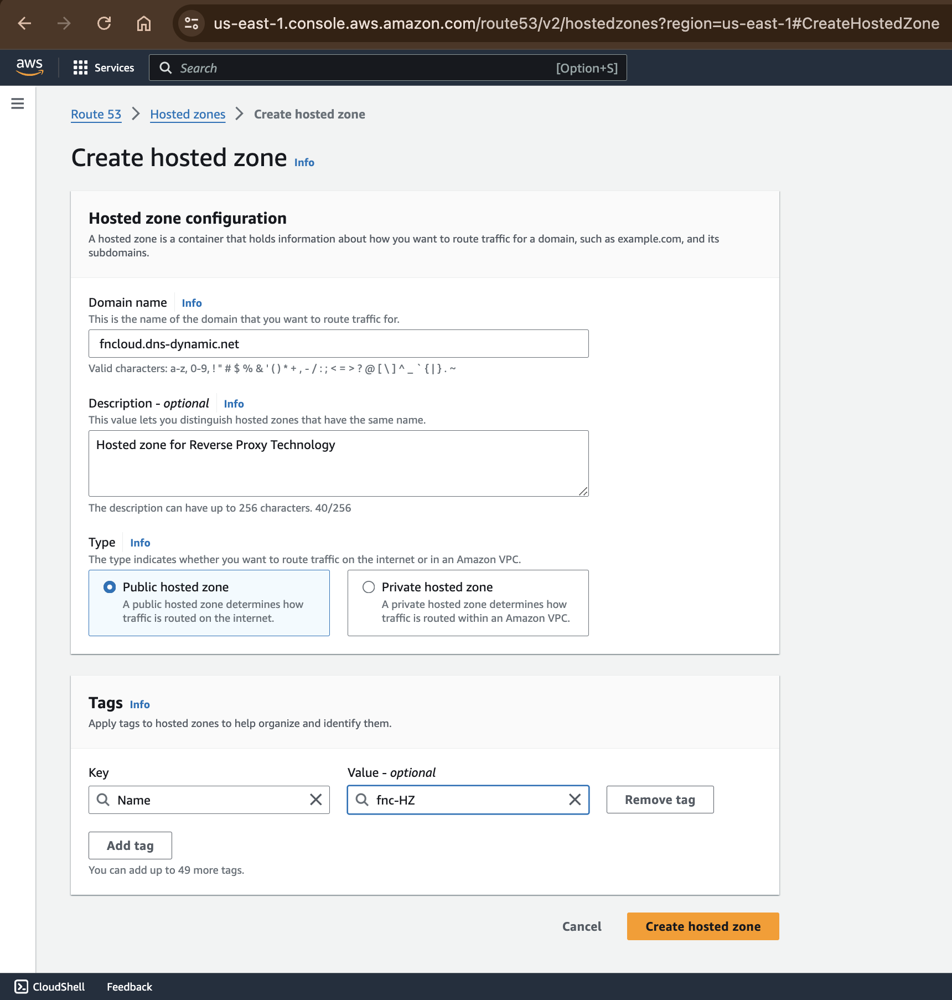
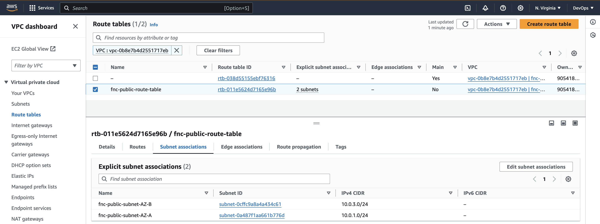
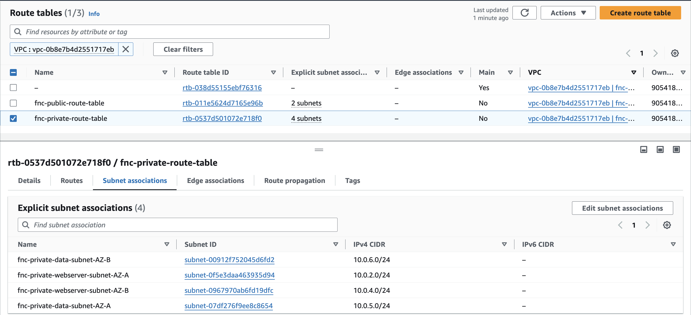
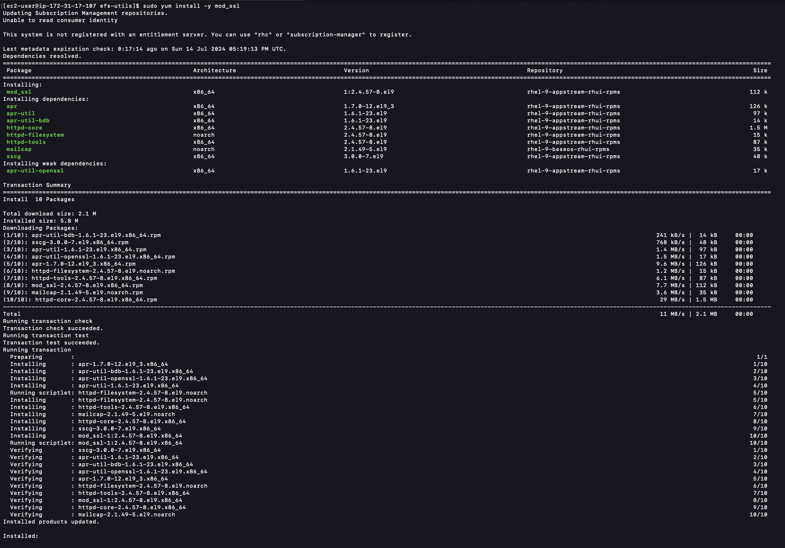
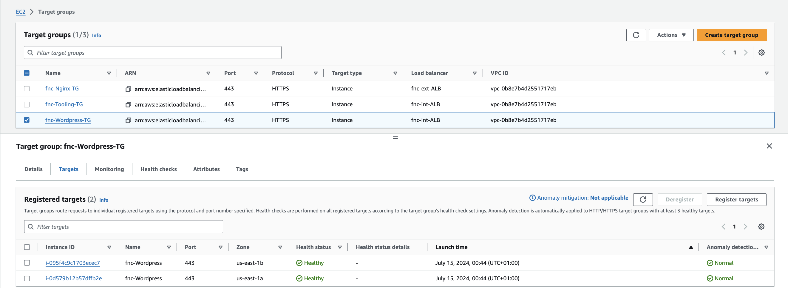

# AWS CLOUD SOLUTION FOR 2 COMPANY WEBSITES USING A REVERSE PROXY TECHNOLOGY

## INTRODUCTION

This project demostrates how a secure infrastructure inside AWS VPC (Virtual Private Cloud) network is built for a particular company, who uses [WordPress CMS](https://wordpress.com/) for its main business website, and a [Tooling Website](https://github.com/francdomain/tooling) for their DevOps team. As part of the company’s desire for improved security and performance, a decision has been made to use a [reverse proxy technology from NGINX](https://docs.nginx.com/nginx/admin-guide/web-server/reverse-proxy/) to achieve this. The infrastructure will look like following diagram:


# Starting Off Your AWS Cloud Project

# Set Up a Sub-account And Create A Hosted Zone

There are few requirements that must be met before you begin:

1. Properly configure your AWS account and Organization Unit [Watch How To Do This Here](https://www.youtube.com/watch?v=9PQYCc_20-Q)


   - Create an `AWS Master account`. (Also known as Root Account)

     Go to AWS console, and navigate to Services > All Services > Management & Governance > AWS Organizations

   

   - Within the Root account, create a sub-account and name it `DevOps`. (You will need another email address to complete this)

      Navigate to Add an AWS accout > fill the name (DevOps)

   
   

   - Within the Root account, create an `AWS Organization Unit (OU)`. Name it `Dev`. (We will launch Dev resources in there)

      From the AWS Organization page, Click on root > Action > Create new

   

   - Move the `DevOps` account into the `Dev OU`.

      Slecte the account to move, then Click Action > Move, then select the OU to move the account to and click move AWS account.

   
   

   - Login to the newly created AWS account using the new email address.

   

2. Create a free domain name for your fictitious company at Freenom domain registrar here. We use [cloudns](https://www.cloudns.net) instead.


3. Create a hosted zone in AWS, and map it to your free domain from Freenom. Watch how to do that here

   - Go to `route53` and select `create hosted zone`





- Let's map the hosted zone to our free domain

Copy the name server (NS) values from AWS, then go to your free domain, edit the default `NS` values and update them with the values from AWS.


# Set Up a Virtual Private Network (VPC)

Always make reference to the architectural diagram and ensure that your configuration is aligned with it.

### 1. Create a [VPC](https://docs.aws.amazon.com/vpc/latest/userguide/what-is-amazon-vpc.html).


### Enable DNS hostnames.

Actions > Edit VPC Settings > Enable DNS hostnames


### 2. Create subnets as shown in the architecture

Create public and private subnets in each availablity zones respectively. Thus, we create public subnet in availability zone A and B respectively. We create 4 private subnets with respect to the diagram we are working with as such we create 2 private subnets each in availability zone A and B.


Enable Auto-assign public IPv4 address in the public subnets.
Actions > Edit subnet settings > Enable auto-assign public IPv4


All Subnets


### 3. Create a route table and associate it with public subnets
Create a public route table for the public subnets


Associate it with public subnets.
Click on the route table > Subnet Association > Edit Subnet Association.


The public route table and it's associated public subnets



### 4. Create a route table and associate it with private subnets
Create a private route table for the private subnets


Associate it with private subnets


The route tables



### 5. Create an [Internet Gateway](https://docs.aws.amazon.com/vpc/latest/userguide/VPC_Internet_Gateway.html)


Attach it to the created VPC.


### 6. Edit a route in public route table, and associate it with the Internet Gateway. (This is what allows a public subnet to be accisble from the Internet)

In the public route table, Click route tab > Edit route > Add route
since we are routing traffic to the internet, the destination will be `0.0.0.0/0`


### 7. Create 3 [Elastic IPs](https://docs.aws.amazon.com/AWSEC2/latest/UserGuide/elastic-ip-addresses-eip.html)


### 8. Create a [Nat Gateway](https://docs.aws.amazon.com/vpc/latest/userguide/vpc-nat-gateway.html) and assign one of the Elastic IPs (*The other 2 will be used by [Bastion hosts](https://aws.amazon.com/solutions/implementations/linux-bastion/))


- Edit a route in private route table, and associate it with the Nat Gateway.

  

### 9. Create a [Security Group](https://docs.aws.amazon.com/vpc/latest/userguide/vpc-security-groups.html#CreatingSecurityGroups) for:

- __External [Application Load Balancer](https://aws.amazon.com/elasticloadbalancing/application-load-balancer/):__ External `ALB` will be available from the Internet


- __Bastion Servers:__ Access to the Bastion servers should be allowed only from workstations that need to SSH into the bastion servers. Hence, you can use your workstation public IP address. To get this information, simply go to your terminal and type `curl www.canhazip.com`


- __Nginx Servers:__ Access to Nginx should only be allowed from an external Application Load balancer (ALB).


- __Internal Application Load Balancer:__ This is `not` an internet facing `ALB` rather used to distribute internal traffic comming from Nginx (reverse proxy) to our Webservers Auto Scalling Groups in our private subnets. It also helps us to prevent single point of failure.


- __Webservers:__ Access to Webservers should only be allowed from the internal ALB.


- __Data Layer:__ Access to the Data layer, which is comprised of [Amazon Relational Database Service (`RDS`)](https://aws.amazon.com/rds/) and [Amazon Elastic File System (EFS)](https://aws.amazon.com/efs/) must be carefully desinged - only webservers should be able to connect to `RDS`, while Nginx and Webservers will have access to `EFS Mountpoint`.


All Security Groups


# TLS Certificates From Amazon Certificate Manager (ACM)

We will need TLS certificates to handle secured connectivity to our Application Load Balancers (ALB).

1. Navigate to AWS ACM
2. Request a public wildcard certificate for the domain name we registered in Cloudns
3. Use DNS to validate the domain name
4. Tag the resource


- Ensure to create record on Route 53 after creating the certificate. This will generate a CNAME record type in Route 53. We will attach this certificate to all the load balancers.

  - Click, Create records in Route 53 > Create records

    

    

    Copy the CNAME name and the CNAME value generated then
    Go to Cloudns, Click on CNAME > Add new record. Paste the CNAME name and value to validate the record for AWS to issue the certificate (The Certificate status remain pending unitl the record is validated by the Domain provider.)

    

    

    After validating the record, AWS will issue the Certificate and the status changes to issued.

    


# Setup EFS

[Amazon Elastic File System (Amazon EFS)](https://docs.aws.amazon.com/AWSEC2/latest/UserGuide/AmazonEFS.html) provides a simple, scalable, fully managed elastic [Network File System (NFS)](https://en.wikipedia.org/wiki/Network_File_System) for use with AWS Cloud services and on-premises resources. In this project, we will utulize EFS service and mount filesystems on both Nginx and Webservers to store data.

1. Create an EFS filesystem

2. Create an EFS mount target per AZ in the VPC, associate it with both subnets dedicated for data layer.
__NB:__ Any subnet we specify our mount target, the Amazon EFS becomes available in that subnet. As such, we will specify it in private webserver subnets so that all the resources in that subnet will have the ability to mount to the file system.

3. Associate the Security groups created earlier for data layer.


4. Create an EFS access point.

This will specify where the webservers will mount with, thus creating 2 mount points for Tooling and Wordpress servers each.

Access point for wordpress server


Access point for tooling server


EFS access points


# Setup RDS

### Pre-requisite:
Create a `KMS` key from Key Management Service (KMS) to be used to encrypt the database instance.


Amazon Relational Database Service (Amazon RDS) is a managed distributed relational database service by Amazon Web Services. This web service running in the cloud designed to simplify setup, operations, maintenans & scaling of relational databases. Without RDS, Database Administrators (DBA) have more work to do, due to RDS, some DBAs have become jobless.
To ensure that yout databases are highly available and also have failover support in case one availability zone fails, we will configure a [multi-AZ](https://docs.aws.amazon.com/AmazonRDS/latest/UserGuide/Concepts.MultiAZ.html) set up of [RDS MySQL database](https://docs.aws.amazon.com/AmazonRDS/latest/UserGuide/CHAP_MySQL.html) instance. In our case, since we are only using 2 AZs, we can only failover to one, but the same concept applies to 3 Availability Zones. We will not consider possible failure of the whole Region, but for this AWS also has a solution - this is a more advanced concept that will be discussed in following projects.

To configure `RDS`, follow steps below:
1. Create a `subnet group` and add 2 private subnets (data Layer)


2. Create an RDS Instance for `mysql 8.*.*`


3. To satisfy our architectural diagram, you will need to select either `Dev/Test` or `Production` Sample Template. But to minimize AWS cost, you can select the `Do not create a standby instance` option under `Availability & durability` sample template (The production template will enable Multi-AZ deployment)


4. Configure other settings accordingly (For test purposes, most of the default settings are good to go). In the real world, you will need to size the database appropriately. You will need to get some information about the usage. If it is a highly transactional database that grows at 10GB weekly, you must bear that in mind while configuring the initial storage allocation, storage autoscaling, and maximum storage threshold.


5. Configure VPC and security (ensure the database is not available from the Internet)


6. Configure backups and retention
7. Encrypt the database using the KMS key created earlier
8. Enable [CloudWatch](https://docs.aws.amazon.com/AmazonRDS/latest/UserGuide/monitoring-cloudwatch.html) monitoring and export Error and Slow Query logs (for production, also include Audit)


# Proceed With Compute Resources

We will need to set up and configure compute resources inside our VPC. The recources related to compute are:

- [EC2 Instances](https://www.amazonaws.cn/en/ec2/instance-types/)
- [Launch Templates](https://docs.aws.amazon.com/autoscaling/ec2/userguide/launch-templates.html)
- [Target Groups](https://docs.aws.amazon.com/elasticloadbalancing/latest/application/load-balancer-target-groups.html)
- [Autoscaling Groups](https://docs.aws.amazon.com/autoscaling/ec2/userguide/auto-scaling-groups.html)
- [TLS Certificates](https://en.wikipedia.org/wiki/Transport_Layer_Security)
- [Application Load Balancers (ALB)](https://docs.aws.amazon.com/elasticloadbalancing/latest/application/introduction.html)

## Set Up Compute Resources for Nginx, Bastion and Webservers

NB:
To create the `Autoscaling Groups`, we need `Launch Templates` and `Load Balancers`.
The Launch Templates requires `AMI` and `Userdata` while the Load balancer requires `Target Group`

### Provision EC2 Instances for Nginx, Bastion and Webservers

1. Create EC2 Instances based on CentOS [Amazon Machine Image (AMI)](https://docs.aws.amazon.com/AWSEC2/latest/UserGuide/AMIs.html) per each [Availability Zone in the same Region](https://docs.aws.amazon.com/AWSEC2/latest/UserGuide/using-regions-availability-zones.html). Use EC2 instance of [T2 family](https://aws.amazon.com/ec2/instance-types/t2/) (e.g. t2.micro or similar) with security group (All traffic - anywhere).


2. Ensure that it has the following software installed:
- python
- ntp
- net-tools
- vim
- wget
- telnet
- epel-release
- htop

### For Nginx, Bastion and Webserver.

__For Nginx__

```bash
sudo yum install -y https://dl.fedoraproject.org/pub/epel/epel-release-latest-9.noarch.rpm
```


```bash
sudo yum install -y dnf-utils http://rpms.remirepo.net/enterprise/remi-release-9.rpm
```


```bash
sudo yum install wget vim python3 telnet htop net-tools ntp -y
```


The error occured because the ntp package is not available in the repositories for our Enterprise Linux 9 system. Instead of ntp, chrony can be used, which is the default NTP implementation in newer versions of RHEL and its derivatives, including Enterprise Linux 9.

```bash
sudo yum install wget vim python3 telnet htop git mysql net-tools chrony -y
```


```bash
sudo systemctl start chronyd
sudo systemctl enable chronyd
sudo systemctl status chronyd
```


__NB__: __Repeat the above steps for Bastion and Webservers__


### Nginx and Webserver (Set SELinux policies so that our servers can function properly on all the redhat instance).

__For Nginx__

```bash
sudo setsebool -P httpd_can_network_connect=1
sudo setsebool -P httpd_can_network_connect_db=1
sudo setsebool -P httpd_execmem=1
sudo setsebool -P httpd_use_nfs 1
```


__NB: Repeat the step above for Webservers__


### Install Amazon EFS utils for mounting the targets on the Elastic file system (Nginx and Webserver).

__For Nginx__

```bash
git clone https://github.com/aws/efs-utils

cd efs-utils
```


```bash
sudo yum install -y make
```


```bash
sudo yum install -y rpm-build
```


```bash
# openssl-devel is needed by amazon-efs-utils-2.0.4-1.el9.x86_64
sudo yum install openssl-devel -y
```


```bash
# Cargo command needs to be installed as it is necessary for building the Rust project included in the source.
sudo yum install cargo -y
```


```bash
sudo make rpm
```


```bash
sudo yum install -y  ./build/amazon-efs-utils*rpm
```


__Repeat the steps above for Webservers__


We are using an ACM (Amazon Certificate Manager) certificate for both our external and internal load balancers.
But for some reasons, we might want to add a self-signed certificate:

- __Compliance Requirements:__
  - Certain industry regulations and standards (e.g., PCI DSS, HIPAA) require end-to-end encryption, including between internal load balancers and backend servers (within a private network).

- __Defense in Depth:__
  - Adding another layer of security by encrypting traffic between internal load balancers and web servers can provide additional protection.

When generating the certificate, In the common name, enter the private IPv4 dns of the instance (for Webserver and Nginx). We use the certificate by specifying the path to the file fnc.crt and fnc.key in the nginx configuration.

## Set up self-signed certificate for the nginx instance

```bash
sudo mkdir /etc/ssl/private

sudo chmod 700 /etc/ssl/private

sudo openssl req -x509 -nodes -days 365 -newkey rsa:2048 -keyout /etc/ssl/private/fnc.key -out /etc/ssl/certs/fnc.crt
```


```bash
sudo openssl dhparam -out /etc/ssl/certs/dhparam.pem 2048
```


## Set up self-signed certificate for the Apache Webserver instance

```bash
sudo yum install -y mod_ssl
```


```bash
sudo openssl req -newkey rsa:2048 -nodes -keyout /etc/pki/tls/private/fnc.key -x509 -days 365 -out /etc/pki/tls/certs/fnc.crt
```


```bash
# Edit the ssl.conf to conform with the key and crt file created.
sudo vim /etc/httpd/conf.d/ssl.conf
```


## [Create an AMI](https://docs.aws.amazon.com/toolkit-for-visual-studio/latest/user-guide/tkv-create-ami-from-instance.html) out of the EC2 instances

On the EC2 instance page, Go to Actions > Image and templates > Create image

__For Bastion AMI__


__For Nginx AMI__


__For Webservers AMI__


__All AMIs__


## CONFIGURE TARGET GROUPS

Create Target groups for Nginx, Worpress and Tooling

__For Nginx Target Group__


__For Wordpress Target Group__


__For Tooling Target Group__


# Configure Application Load Balancer (ALB)

### External Application Load Balancer To Route Traffic To NGINX

Nginx EC2 Instances will have configurations that accepts incoming traffic only from Load Balancers. No request should go directly to Nginx servers. With this kind of setup, we will benefit from intelligent routing of requests from the ALB to Nginx servers across the 2 Availability Zones. We will also be able to [offload](https://avinetworks.com/glossary/ssl-offload/) SSL/TLS certificates on the ALB instead of Nginx. Therefore, Nginx will be able to perform faster since it will not require extra compute resources to valifate certificates for every request.

1. Create an Internet facing ALB
2. Ensure that it listens on HTTPS protocol (TCP port 443)
3. Ensure the ALB is created within the appropriate VPC | AZ | Subnets
4. Choose the Certificate from ACM
5. Select Security Group
6. Select Nginx Instances as the target group


### Application Load Balancer To Route Traffic To Webservers

Since the webservers are configured for auto-scaling, there is going to be a problem if servers get dynamically scalled out or in. Nginx will not know about the new IP addresses, or the ones that get removed. Hence, Nginx will not know where to direct the traffic.

To solve this problem, we must use a load balancer. But this time, it will be an internal load balancer. Not Internet facing since the webservers are within a private subnet, and we do not want direct access to them.

1. Create an Internal ALB
2. Ensure that it listens on HTTPS protocol (TCP port 443)
3. Ensure the ALB is created within the appropriate VPC | AZ | Subnets
4. Choose the Certificate from ACM
5. Select Security Group
6. Select webserver Instances as the target group
7. Ensure that health check passes for the target group

__NOTE:__ This process must be repeated for both WordPress and Tooling websites.


The default target configured on the listener while creating the internal load balancer is to forward traffic to wordpress on port 443. Hence, we need to create a rule to route traffic to tooling as well.

1.	Select internal load balancer from the list of load balancers created:
	-	Choose the load balancer where you want to add the rule.
2.	Listeners Tab:
	-	Click on the Listeners tab.
	-	Select the listener (HTTPS:443) and click Manage listener.
3.	Add Rules:
	-	Click on Add rule.
4.	Configure the Rule:
	-	Give the rule a name and click next.
	-	Add a condition by selecting `Host header`.
	-	Enter the `hostnames` for which you want to route traffic. (tooling.com and www.tooling.com).
	-	Choose the appropriate target group for the `hostname`.


## PREPARE LAUNCH TEMPLATE FOR NGINX (ONE PER SUBNET)

1. Make use of the AMI to set up a launch template
2. Ensure the Instances are launched into a public subnet.
3. Assign appropriate security group.
4. Configure [Userdata](https://docs.aws.amazon.com/AWSEC2/latest/UserGuide/user-data.html) to update yum package repository and install nginx.
Ensure to `enable auto-assign public IP` in the Advance Network Configuration


We need to update the reverse.conf file by updating proxy_pass value to the end point of the internal load balancer (DNS name) before using the userdata so as to clone the updated repository.


__Repeat the same setting for Bastion, the difference here is the userdata input, AMI and security group__.


### Wordpress Userdata

NB: Both Wordpress and Tooling make use of Webserver AMI.

Update the mount point to the file system, this should be done on access points for tooling and wordpress respectively.

`sudo mount -t efs -o tls,accesspoint=fsap-0941d279e4caf2238 fs-01bb3fe22fdd61691:/ /var/www/`


The RDS end point is also needed


Paste the rds end-point in the wordpress userdata and tooling userdata

```bash
#!/bin/bash
mkdir /var/www/

sudo mount -t efs -o tls,accesspoint=fsap-0941d279e4caf2238 fs-01bb3fe22fdd61691:/ /var/www/

yum install -y httpd
systemctl start httpd
systemctl enable httpd

yum module reset php -y
yum module enable php:remi-7.4 -y

yum install -y php php-common php-mbstring php-opcache php-intl php-xml php-gd php-curl php-mysqlnd php-fpm php-json

systemctl start php-fpm
systemctl enable php-fpm

wget http://wordpress.org/latest.tar.gz

tar xzvf latest.tar.gz
rm -rf latest.tar.gz

cp wordpress/wp-config-sample.php wordpress/wp-config.php
mkdir /var/www/html/
cp -R /wordpress/* /var/www/html/
cd /var/www/html/
touch healthstatus

sed -i "s/localhost/fnc-database.ch8uqc8uw3p0.us-east-1.rds.amazonaws.com/g" wp-config.php
sed -i "s/username_here/adminuser/g" wp-config.php
sed -i "s/password_here/Admin123$/g" wp-config.php
sed -i "s/database_name_here/wordpressdb/g" wp-config.php

chcon -t httpd_sys_rw_content_t /var/www/html/ -R

systemctl restart httpd
```


### Tooling userdata

```bash
#!/bin/bash
mkdir /var/www/

sudo mount -t efs -o tls,accesspoint=fsap-0a05d5cb95059314c fs-01bb3fe22fdd61691:/ /var/www/

yum install -y httpd
systemctl start httpd
systemctl enable httpd

yum module reset php -y
yum module enable php:remi-7.4 -y

yum install -y php php-common php-mbstring php-opcache php-intl php-xml php-gd php-curl php-mysqlnd php-fpm php-json

systemctl start php-fpm
systemctl enable php-fpm

git clone https://github.com/francdomain/tooling.git

mkdir /var/www/html
cp -R /tooling/html/*  /var/www/html/
cd /tooling

mysql -h fnc-database.ch8uqc8uw3p0.us-east-1.rds.amazonaws.com -u adminuser -p toolingdb < tooling-db.sql

cd /var/www/html/
touch healthstatus

sed -i "s/$db = mysqli_connect('mysql.tooling.svc.cluster.local', 'admin', 'admin', 'tooling');/$db = mysqli_connect('fnc-database.ch8uqc8uw3p0.us-east-1.rds.amazonaws.com', 'adminuser', 'Admin123$', 'toolingdb');/g" functions.php

chcon -t httpd_sys_rw_content_t /var/www/html/ -R

mv /etc/httpd/conf.d/welcome.conf /etc/httpd/conf.d/welcome.conf_backup

systemctl restart httpd
```


__All launch templates created__.


## CONFIGURE AUTOSCALING FOR NGINX

1. Select the right launch template
2. Select the VPC
3. Select both public subnets
4. Enable Application Load Balancer for the AutoScalingGroup (ASG)
5. Select the target group you created before
6. Ensure that you have health checks for both EC2 and ALB
7. The desired capacity is 2
8. Minimum capacity is 2
9. Maximum capacity is 4
10. Set [scale out](https://docs.aws.amazon.com/autoscaling/ec2/userguide/ec2-auto-scaling-lifecycle.html) if CPU utilization reaches 90%
11. Ensure there is an [SNS](https://docs.aws.amazon.com/sns/latest/dg/welcome.html) topic to send scaling notifications

### Create Auto Scaling Group for Bation


__Access RDS through Bastion connection to craete database for wordpress and tooling.__

 Copy the RDS endpoint to be used as host


### Create Auto Scaling Group for Nginx


### Repeat the Nginx Auto Scaling Group steps above for Wordpress and Tooling with their right launch template

All Auto Scaling Groups


# Configuring DNS with Route53

Earlier in this project we registered a free domain with `Cloudns` and configured a hosted zone in [Route53](https://docs.aws.amazon.com/Route53/latest/DeveloperGuide/Welcome.html). But that is not all that needs to be done as far as `DNS` configuration is concerned.

We need to ensure that the main domain for the WordPress website can be reached, and the subdomain for Tooling website can also be reached using a browser.

Create other records such as [CNAME, alias and A records](https://docs.aws.amazon.com/Route53/latest/DeveloperGuide/route-53-concepts.html).

NOTE: You can use either CNAME or alias records to achieve the same thing. But alias record has better functionality because it is a faster to resolve DNS record, and can coexist with other records on that name. Read [here](https://support.dnsimple.com/articles/differences-between-a-cname-alias-url/#:~:text=The%20A%20record%20maps%20a,a%20name%20to%20another%20name.&text=The%20ALIAS%20record%20maps%20a,the%20HTTP%20301%20status%20code) to get to know more about the differences.

- Create an alias record for the root domain and direct its traffic to the ALB DNS name.
- Create an alias record for `tooling.fncloud.dns-dynamic.net` and direct its traffic to the ALB DNS name.


### Ensure that health check passes for the target groups

__Nginx Target Group Health Check__


__Wordpress Target Group Health Check__



__Tooling Target Group Health Check__


All instances


__Access the tooling webserver using Bastion  to Confirm the userdata configuration for database connection in functions.php file__.


__Now let us access our tooling website via a browser using our DNS name__


__Let's access our wordpress website__


We have just created a secured, scalable and cost-effective infrastructure to host 2 enterprise websites using various Cloud services from AWS. At this point, our infrastructure is ready to host real websites' load.

