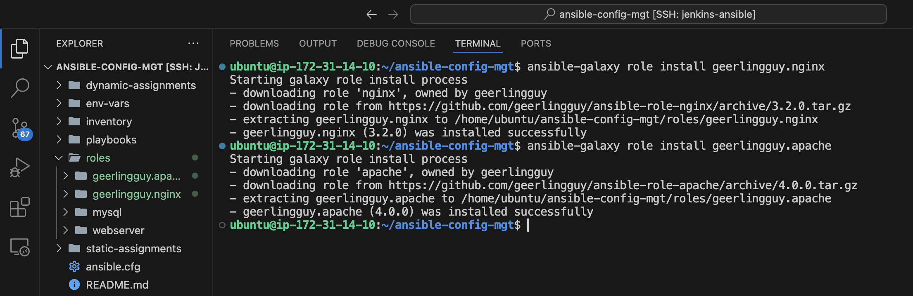

# Ansible Dynamic Assignments (Include) and Community Roles

In this project we will introduce [dynamic assignments](https://docs.ansible.com/ansible/latest/playbook_guide/playbooks_reuse.html#includes-dynamic-re-use) by using `include module`.
We will continue configuring our `UAT servers`, learn and practice new Ansible concepts and modules.

### EC2 Instances for this project

Ansible server


UAT Web server 1


UAT Web server 2


Load balancer server


Load balancer security group inbound rule


DB


From [previous project](https://steghub.com/lessons/ansible-refactoring-static-assignments-imports-and-roles-101/), we can already tell that static assignments use `import` Ansible module. The module that enables dynamic assignments is `include`.

Hence,
```bash
import = Static
include = Dynamic
```

When the `import` module is used, all statements are pre-processed at the time playbooks are parsed. Meaning, when you execute `site.yml` playbook, Ansible will process all the playbooks referenced during the time it is parsing the statements. This also means that, during actual execution, if any statement changes, such statements will not be considered. Hence, it is `static`.
On the other hand, when `include` module is used, all statements are processed only during execution of the playbook. Meaning, after the statements are parsed, any changes to the statements encountered during execution will be used.

Take note that in most cases it is recommended to use `static assignments` for playbooks, because it is more reliable. With `dynamic` ones, it is hard to debug playbook problems due to its dynamic nature. However, you can use dynamic assignments for environment specific variables as we will be introducing in this project.


## Introducing Dynamic Assignment Into Our structure

In your `https://github.com/<your-name>/ansible-config-mgt` GitHub repository start a new branch and call it `dynamic-assignments`.

```bash
git checkout -b dynamic-assignments
```

Create a new folder, name it `dynamic-assignments`.
Then inside this folder, create a new file and name it `env-vars.yml`. We will instruct `site.yml` to `include` this playbook later. For now, let us keep building up the structure.

```bash
mkdir dynamic-assignments
touch dynamic-assignments/env-vars.yml
```


Your GitHub shall have following structure by now.

__Note__: Depending on what method you used in the previous project you may have or not have `roles` folder in your GitHub repository - if you used `ansible-galaxy`, then `roles` directory was only created on your `Jenkins-Ansible` server locally. It is recommended to have all the codes managed and tracked in GitHub, so you might want to recreate this structure manually in this case - it is up to you.

```css
├── dynamic-assignments
│   └── env-vars.yml
├── inventory
│   └── dev
    └── stage
    └── uat
    └── prod
└── playbooks
    └── site.yml
└── roles (optional folder)
    └──...(optional subfolders & files)
└── static-assignments
    └── common.yml
```

Since we will be using the same Ansible to configure multiple environments, and each of these environments will have certain unique attributes, such as `servername`, `ip-address` etc., we will need a way to set values to variables per specific environment.

For this reason, we will now create a folder to keep each environment's variables file. Therefore, create a new folder `env-vars`, then for each environment, create new `YAML` files which we will use to set variables.

```bash
mkdir env-vars

touch env-vars/dev.yml env-vars/stage.yml env-vars/uat.yml env-vars/prod.yml
```


Your layout should now look like this.

```css
├── dynamic-assignments
│   └── env-vars.yml
├── env-vars
    └── dev.yml
    └── stage.yml
    └── uat.yml
    └── prod.yml
├── inventory
    └── dev
    └── stage
    └── uat
    └── prod
├── playbooks
    └── site.yml
└── static-assignments
    └── common.yml
    └── webservers.yml
```

Now paste the instruction below into the `env-vars.yml` file.

```yaml
---
- name: looping through list of available files
  include_vars: "{{ item }}"
  with_first_found:
    - files:
        - dev.yml
        - stage.yml
        - prod.yml
        - uat.yml
      paths:
        - "{{ playbook_dir }}/../env-vars"
  tags:
    - always
```


Notice 3 things to notice here:

1. We used `include_vars` syntax instead of `include`, this is because Ansible developers decided to separate different features of the module. From Ansible version 2.8, the `include` module is deprecated and variants of `include_*` must be used. These are:

- [include_role](https://docs.ansible.com/ansible/latest/collections/ansible/builtin/include_role_module.html#include-role-module)
- [include_tasks](https://docs.ansible.com/ansible/latest/collections/ansible/builtin/include_tasks_module.html#include-tasks-module)
- [include_vars](https://docs.ansible.com/ansible/latest/collections/ansible/builtin/include_vars_module.html#include-vars-module)

In the same version, variants of `import` were also introduces, such as:

- [import_role](https://docs.ansible.com/ansible/latest/collections/ansible/builtin/import_role_module.html#import-role-module)
- [import_tasks](https://docs.ansible.com/ansible/latest/collections/ansible/builtin/import_tasks_module.html#import-tasks-module)

2. We made use of a [special variables](https://docs.ansible.com/ansible/latest/reference_appendices/special_variables.html) `{{ playbook_dir }}` and `{{ inventory_file }}`. `{{ playbook_dir }}` will help Ansible to determine the location of the running playbook, and from there navigate to other path on the filesystem. `{{ inventory_file }}` on the other hand will dynamically resolve to the name of the inventory file being used, then append `.yml` so that it picks up the required file within the `env-vars` folder.

3. We are including the variables using a loop. `with_first_found` implies that, looping through the list of files, the first one found is used. This is good so that we can always set default values in case an environment specific env file does not exist.


## Update `site.yml` with dynamic assignments

Update `site.yml` file to make use of the dynamic assignment. (At this point, we cannot test it yet. We are just setting the stage for what is yet to come. So hang on to your hats)

`site.yml` should now look like this.

```yaml
---
- hosts: all
  name: Include dynamic variables
  become: yes
  tasks:
    - include_tasks: ../dynamic-assignments/env-vars.yml
      tags:
        - always

- import_playbook: ../static-assignments/common.yml

- import_playbook: ../static-assignments/uat-webservers.yml

- import_playbook: ../static-assignments/loadbalancers.yml
```

## Community Roles

Now it is time to create a role for `MySQL` database - it should install the `MySQL` package, create a database and configure users. But why should we re-invent the wheel? There are tons of roles that have already been developed by other open source engineers out there. These roles are actually production ready, and dynamic to accomodate most of Linux flavours. With Ansible Galaxy again, we can simply download a ready to use ansible role, and keep going.

## Download Mysql Ansible Role

You can browse available community roles [here](https://galaxy.ansible.com/ui/)
We will be using a [MySQL role developed by geerlingguy](https://galaxy.ansible.com/ui/standalone/roles/geerlingguy/mysql/).

__Hint__: To preserve your your GitHub in actual state after you install a new role - make a commit and push to master your `ansible-config-mgt` directory. Of course you must have `git` installed and configured on `Jenkins-Ansible` server and, for more convenient work with codes, you can configure `Visual Studio Code to work with this directory`. In this case, you will no longer need webhook and Jenkins jobs to update your codes on `Jenkins-Ansible` server, so you can disable it - we will be using Jenkins later for a better purpose.

### Configure vscode to work with the directory (`ansible-config-mgt`)

__Configure SSH for vscode__


HostName = Jenkins-Ansible Public IP Address


Select the target directory


On `Jenkins-Ansible` server make sure that `git` is installed with `git --version`, then go to `ansible-config-mgt` directory and run

```bash
git init
git pull https://github.com/<your-name>/ansible-config-mgt.git
git remote add origin https://github.com/<your-name>/ansible-config-mgt.git
git branch roles-feature
git switch roles-feature
```


__Inside `roles` directory create your new `MySQL role` with `ansible-galaxy` install `geerlingguy.mysql`__

```bash
ansible-galaxy role install geerlingguy.mysql
```


__Rename the folder to `mysql`__

```bash
mv geerlingguy.mysql/ mysql
```


Read README.md file, and edit roles configuration to use correct credentials for MySQL required for the tooling website.

__Create Database and mysql user (`roles/mysql/vars/main.yml`)__

```yaml
mysql_root_password: ""
mysql_databases:
  - name: tooling
    encoding: utf8
    collation: utf8_general_ci
mysql_users:
  - name: webaccess
    host: "172.31.32.0/20" # Webserver subnet cidr
    password: Admin123
    priv: "tooling.*:ALL"
```


__Create a new playbook inside `static-assignments` folder and name it `db-servers.yml` , update it with `mysql` roles.__

```yaml
- hosts: db_servers
  become: yes
  vars_files:
    - vars/main.yml
  roles:
    - { role: mysql }
```


__Now it is time to upload the changes into your GitHub:__

```bash
git add .
git commit -m "Commit new role files into GitHub"
git push --set-upstream origin roles-feature
```


__Now, if you are satisfied with your codes, you can create a Pull Request.__


__Merge it to `main` branch on GitHub__


# Load Balancer roles

We want to be able to choose which Load Balancer to use, `Nginx` or `Apache`, so we need to have two roles respectively:

1. Nginx
2. Apache

With your experience on Ansible so far you can:

- Decide if you want to develop your own roles, or find available ones from the community

### Using the Community


```bash
ansible-galaxy role install geerlingguy.nginx

ansible-galaxy role install geerlingguy.apache
```


__Rename the installed Nginx and Apache roles__

```bash
mv geerlingguy.nginx nginx

mv geerlingguy.apache apache
```


__The folder structure now looks like this__


- __Update both static-assignment and site.yml files to refer the roles__

__Important Hints:__

- Since you cannot use both `Nginx` and `Apache` load balancer, you need to add a condition to enable either one - this is where you can make use of variables.
- Declare a variable in `defaults/main.yml` file inside the `Nginx` and `Apache` roles. Name each variables `enable_nginx_lb` and `enable_apache_lb` respectively.
- Set both values to `false` like this `enable_nginx_lb: false` and `enable_apache_lb: false`.
- Declare another variable in both roles `load_balancer_is_required` and set its value to `false` as well

### For nginx

```yaml
# roles/nginx/defaults/main.yml
enable_nginx_lb: false
load_balancer_is_required: false
```


### For apache

```yaml
# roles/apache/defaults/main.yml
enable_apache_lb: false
load_balancer_is_required: false
```


### Update assignment

`loadbalancers.yml` file

```yaml
---
- hosts: lb
  become: yes
  roles:
    - role: nginx
      when: enable_nginx_lb | bool and load_balancer_is_required | bool
    - role: apache
      when: enable_apache_lb | bool and load_balancer_is_required | bool
```


- Update `site.yml` files respectively

```yaml
---
- hosts: all
  name: Include dynamic variables
  become: yes
  tasks:
    - include_tasks: ../dynamic-assignments/env-vars.yml
      tags:
        - always

- import_playbook: ../static-assignments/common.yml

- import_playbook: ../static-assignments/uat-webservers.yml

- import_playbook: ../static-assignments/loadbalancers.yml

- import_playbook: ../static-assignments/db-servers.yml
```


Now you can make use of `env-vars\uat.yml` file to define which `loadbalancer` to use in UAT environment by setting respective environmental variable to `true`.

You will activate load balancer, and enable `nginx` by setting these in the respective environment's `env-vars` file.

__Enable Nginx__

```yaml
enable_nginx_lb: true
load_balancer_is_required: true
```


# Set up for Nginx Load Balancer

### Update roles/nginx/defaults/main.yml

__Configure Nginx virtuel host__

```yaml
---
nginx_vhosts:
  - listen: "80"
    server_name: "example.com"
    root: "/var/www/html"
    index: "index.php index.html index.htm"
    locations:
              - path: "/"
                proxy_pass: "http://myapp1"

    # Properties that are only added if defined:
    server_name_redirect: "www.example.com"
    error_page: ""
    access_log: ""
    error_log: ""
    extra_parameters: ""
    template: "{{ nginx_vhost_template }}"
    state: "present"

nginx_upstreams:
- name: myapp1
  strategy: "ip_hash"
  keepalive: 16
  servers:
    - "172.31.35.223 weight=5"
    - "172.31.34.101 weight=5"

nginx_log_format: |-
  '$remote_addr - $remote_user [$time_local] "$request" '
  '$status $body_bytes_sent "$http_referer" '
  '"$http_user_agent" "$http_x_forwarded_for"'
become: yes
```


### Update `roles/nginx/templates/nginx.conf.j2`

Comment the line `include {{ nginx_vhost_path }}/*;`


This line renders the `/etc/nginx/sites-enabled/` to the `http` configuration of Nginx.

#### Create a `server block` template in `Nginx.conf.j2` for nginx configuration file to override the default in nginx role.

```jinja

    server {
        listen {{ vhost.listen }};
        server_name {{ vhost.server_name }};
        root {{ vhost.root }};
        index {{ vhost.index }};

    
        location {{ location.path }} {
            proxy_pass {{ location.proxy_pass }};
        }
    
  }

```


#### Update `inventory/uat`

```yaml
[lb]
load_balancer ansible_host=172.31.6.105 ansible_ssh_user='ubuntu'

[uat_webservers]
Web1 ansible_host=172.31.35.223 ansible_ssh_user='ec2-user'
Web2 ansible_host=172.31.34.101 ansible_ssh_user='ec2-user'

[db_servers]
db ansible_host=172.31.2.161 ansible_ssh_user='ubuntu'
```


__Update Webservers Role in `roles/webservers/tasks/main.yml` to install Epel, Remi's repoeitory, Apache, and PHP__


__Update `roles/nginx/tasks/main.yml` to create a task that check and stop apache if it is running__

```yaml
---
- name: Check if Apache is running
  ansible.builtin.service_facts:

- name: Stop and disable Apache if it is running
  ansible.builtin.service:
    name: apache2
    state: stopped
    enabled: no
  when: "'apache2' in services and services['apache2'].state == 'running'"
  become: yes
```


### Now run the playbook against your uat inventory

```bash
ansible-playbook -i inventory/uat playbooks/site.yml --extra-vars "@env-vars/uat.yml"
```


### Confirm that Nginx is enabled and running and Apache is disabled

__Access load balancer server__

```bash
ssh -i "my-devec2key.pem" ubuntu@3.145.48.108
```


__Check Nginx and Apache status__


### Check ansible configuration for Nginx

```bash
sudo vi /etc/nginx/nginx.conf
```


Update the website's configuration to connect to the database (in /var/www/html/function.php file)

```bash
sudo vi /var/www/html/functions.php
```


Apply tooling-db.sql command on the webseveers

```bash
sudo mysql -h 172.31.2.161 -u webaccess -p tooling < tooling-db.sql
```

__Access the database server from Web Server__

```bash
sudo mysql -h 172.31.2.161 -u webaccess -p
```

__Create in MyQSL a new admin user with username: myuser and password: password__

```SQL
INSERT INTO users(id, username, password, email, user_type, status) VALUES (2, 'myuser', '5f4dcc3b5aa765d61d8327deb882cf99', 'user@mail.com', 'admin', '1');
```

### Access the tooling website using the LB's Public IP address on a browser


The same must work with apache LB, so you can switch it by setting respective environmental variable to true and other to false.

To test this, you can update inventory for each environment and run Ansible against each environment.


# Set up for Apache Load Balancer

__Update `roles/apache/tasks/configure-Dedian.yml`__

Configure Apache virtual host

```yaml
---
- name: Add apache vhosts configuration.
  template:
    src: "{{ apache_vhosts_template }}"
    dest: "{{ apache_conf_path }}/sites-available/{{ apache_vhosts_filename }}"
    owner: root
    group: root
    mode: 0644
  notify: restart apache
  when: apache_create_vhosts | bool
  become: yes

- name: Enable Apache modules
  ansible.builtin.shell:
    cmd: "a2enmod {{ item }}"
  loop:
    - rewrite
    - proxy
    - proxy_balancer
    - proxy_http
    - headers
    - lbmethod_bytraffic
    - lbmethod_byrequests
  notify: restart apache
  become: yes

- name: Insert load balancer configuration into Apache virtual host
  ansible.builtin.blockinfile:
    path: /etc/apache2/sites-available/000-default.conf
    block: |
      <Proxy "balancer://mycluster">
        BalancerMember http://172.31.35.223:80
        BalancerMember http://172.31.34.101:80
        ProxySet lbmethod=byrequests
      </Proxy>
      ProxyPass "/" "balancer://mycluster/"
      ProxyPassReverse "/" "balancer://mycluster/"
    marker: "# {mark} ANSIBLE MANAGED BLOCK"
    insertbefore: "</VirtualHost>"
  notify: restart apache
  become: yes
```


__Update env-vars/uat.yml__

Switch Apache to true and nginx to false


__Update `roles/apache/tasks/main.yml` to create a task that check and stop nginx if it is running__

```yaml
---
- name: Check if nginx is running
  ansible.builtin.service_facts:

- name: Stop and disable nginx if it is running
  ansible.builtin.service:
    name: nginx
    state: stopped
    enabled: no
  when: "'nginx' in services and services['nginx'].state == 'running'"
  become: yes
```


### Now run the playbook against the uat inventory

```bash
ansible-playbook -i inventory/uat playbooks/site.yml --extra-vars "@env-vars/uat.yml"
```


### Confirm that Apache is running and enabled and Nginx is disabled

Access the Load balancer

```bash
ssh -i "my-devec2key.pem" ubuntu@3.145.48.108
```


__Check Apache and Nginx status__


### Check ansible configuration for Apache

```bash
sudo vi /etc/apache2/sites-available/000-default.conf
```


### Access the tooling website using the LB's Public IP address


We have learned and practiced how to use Ansible configuration management tool to prepare UAT environment for Tooling web solution.
