# Ansible Refactoring & Static Assignments (Imports and Roles)

In this project, we will continue working with ansible-config-mgt repository and make some improvements of our code. Now we need to refactor our Ansible code, create assignments, and learn how to use the imports functionality. Imports allow to effectively re-use previously created playbooks in a new playbook - it allows us to organize our tasks and reuse them when needed.


## Step 1 - Jenkins job enhancement

Before we begin, let us make some changes to our Jenkins job - now every new change in the codes creates a separate directory which is not very convenient when we want to run some commands from one place. Besides, it consumes space on Jenkins serves with each subsequent change. Let us enhance it by introducing a new Jenkins project/job - we will require `Copy Artifact` plugin.

1. Go to your `Jenkins-Ansible` server and create a new directory called `ansible-config-artifact` - we will store there all artifacts after each build.

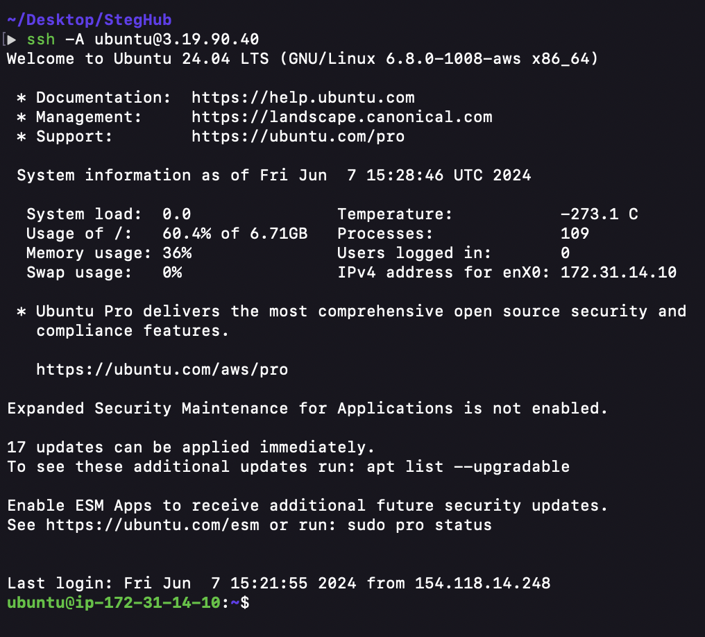

```bash
sudo mkdir /home/ubuntu/ansible-config-artifact
```


2. Change permissions to this directory, so Jenkins could save files there

```bash
chmod -R 0777 /home/ubuntu/ansible-config-artifact
```


3. Go to Jenkins web console -> Manage Jenkins -> Manage Plugins -> on Available tab search for `Copy Artifact` and install this plugin without restarting Jenkins


4. Create a new Freestyle project and name it `save_artifacts`.

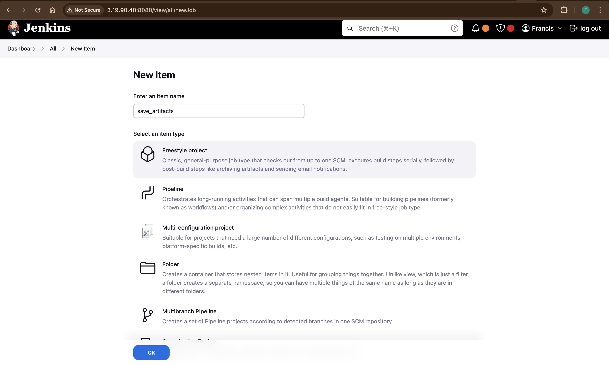

5. This project will be triggered by completion of your existing ansible project. Configure it accordingly

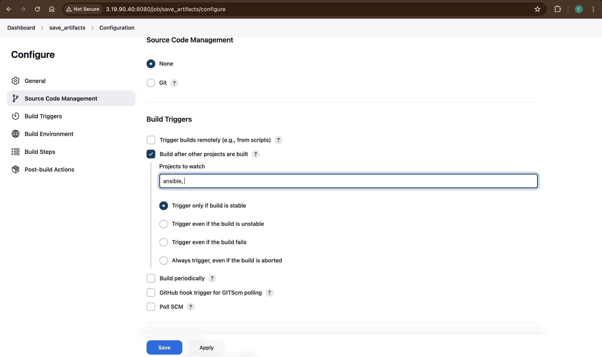

__Note:__ You can configure number of builds to keep in order to save space on the server, for example, you might want to keep only last 2 or 5 build results. You can also make this change to your ansible job.

6. The main idea of `save_artifacts` project is to save artifacts into `/home/ubuntu/ansible-config-artifact` directory. To achieve this, create a `Build` step and choose `Copy artifacts from other project`, specify `ansible` as a source project and `/home/ubuntu/ansible-config-artifact` as a target directory.

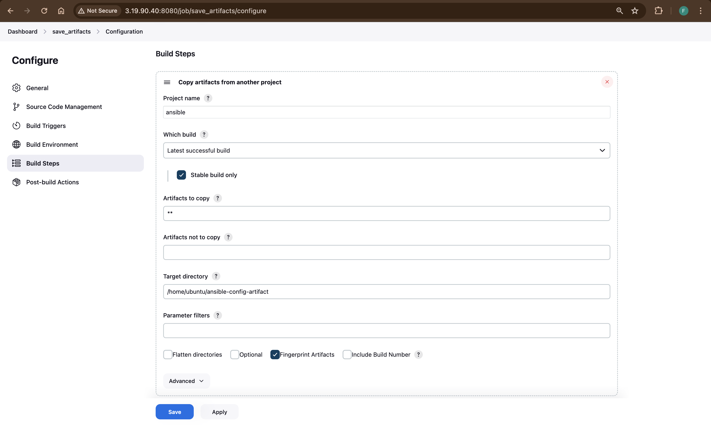

7. Test your set up by making some change in README.MD file inside your `ansible-config-mgt` repository (right inside main branch).


Remove the line - Testing jenkins build


If both Jenkins jobs have completed one after another - you shall see your files inside `/home/ubuntu/ansible-config-artifact` directory and it will be updated with every commit to your master branch.
Now your Jenkins pipeline is more neat and clean.

```bash
Started by upstream project "ansible" build number 13
originally caused by:
 Started by GitHub push by francdomain
Running as SYSTEM
Building in workspace /var/lib/jenkins/workspace/save_artifacts
FATAL: /home/ubuntu/ansible-config-artifact
java.nio.file.AccessDeniedException: /home/ubuntu/ansible-config-artifact
	at java.base/sun.nio.fs.UnixException.translateToIOException(UnixException.java:90)
	at java.base/sun.nio.fs.UnixException.rethrowAsIOException(UnixException.java:106)
	at java.base/sun.nio.fs.UnixException.rethrowAsIOException(UnixException.java:111)
	at java.base/sun.nio.fs.UnixFileSystemProvider.createDirectory(UnixFileSystemProvider.java:397)
	at java.base/java.nio.file.Files.createDirectory(Files.java:700)
	at java.base/java.nio.file.Files.createAndCheckIsDirectory(Files.java:807)
	at java.base/java.nio.file.Files.createDirectories(Files.java:793)
	at hudson.FilePath.mkdirs(FilePath.java:3753)
	at hudson.FilePath$Mkdirs.invoke(FilePath.java:1419)
	at hudson.FilePath$Mkdirs.invoke(FilePath.java:1414)
	at hudson.FilePath.act(FilePath.java:1235)
	at hudson.FilePath.act(FilePath.java:1218)
	at hudson.FilePath.mkdirs(FilePath.java:1409)
	at PluginClassLoader for copyartifact//hudson.plugins.copyartifact.CopyArtifact.copy(CopyArtifact.java:704)
	at PluginClassLoader for copyartifact//hudson.plugins.copyartifact.CopyArtifact.perform(CopyArtifact.java:668)
	at PluginClassLoader for copyartifact//hudson.plugins.copyartifact.CopyArtifact.perform(CopyArtifact.java:552)
	at jenkins.tasks.SimpleBuildStep.perform(SimpleBuildStep.java:123)
	at hudson.tasks.BuildStepCompatibilityLayer.perform(BuildStepCompatibilityLayer.java:80)
	at hudson.tasks.BuildStepMonitor$1.perform(BuildStepMonitor.java:20)
	at hudson.model.AbstractBuild$AbstractBuildExecution.perform(AbstractBuild.java:818)
	at hudson.model.Build$BuildExecution.build(Build.java:199)
	at hudson.model.Build$BuildExecution.doRun(Build.java:164)
	at hudson.model.AbstractBuild$AbstractBuildExecution.run(AbstractBuild.java:526)
	at hudson.model.Run.execute(Run.java:1894)
	at hudson.model.FreeStyleBuild.run(FreeStyleBuild.java:44)
	at hudson.model.ResourceController.execute(ResourceController.java:101)
	at hudson.model.Executor.run(Executor.java:446)
Finished: FAILURE
```
The error above is from the jenkins console output.
This is because jenkins does not have the privillege to write to the `ansible-config-artifact` directory despite setting permission `chmod -R 777 ansible-config-artifact`
This was resolved by adding jenkins user to ubuntu group (has `rwx` permission)

```bash
sudo chown -R ubuntu:jenkins ansible-config-artifact

sudo usermod -a -G jenkins ubuntu  # Add jenkins user to ubuntu group

sudo groups ubuntu  # Confirm jenkins user have been added to ubuntu group
```


Now test the setup again. observe that the build was successful this time


## Step 2 - Refactor Ansible code by importing other playbooks into `site.yml`

Before starting to refactor the codes, ensure that you have pulled down the latest code from master (main) branch, and create a new branch, name it refactor.


`DevOps` philosophy implies constant iterative improvement for better efficiency - refactoring is one of the techniques that can be used, but you always have an answer to question "why?". Why do we need to change something if it works well?

In previous project, you wrote all tasks in a single playbook common.yml, now it is pretty simple set of instructions for only 2 types of `OS`, but imagine you have many more tasks and you need to apply this playbook to other servers with different requirements.
In this case, you will have to read through the whole playbook to check if all tasks written there are applicable and is there anything that you need to add for certain `server/OS` families. Very fast it will become a tedious exercise and your playbook will become messy with many commented parts. Your DevOps colleagues will not appreciate such organization of your codes and it will be difficult for them to use your playbook.

Let see code re-use in action by importing other playbooks.

1. Within `playbooks` folder, create a new file and name it `site.yml` - This file will now be considered as an entry point into the entire infrastructure configuration. Other playbooks will be included here as a reference. In other words, `site.yml` will become a parent to all other playbooks that will be developed. Including common.yml that you created previously.

2. Create a new folder in root of the repository and name it `static-assignments`. The __static-assignments__ folder is where all other children playbooks will be stored. This is merely for easy organization of your work. It is not an Ansible specific concept, therefore you can choose how you want to organize your work. You will see why the folder name has a prefix of __static__ very soon. For now, just follow along.

3. Move `common.yml` file into the newly created `static-assignments` folder.

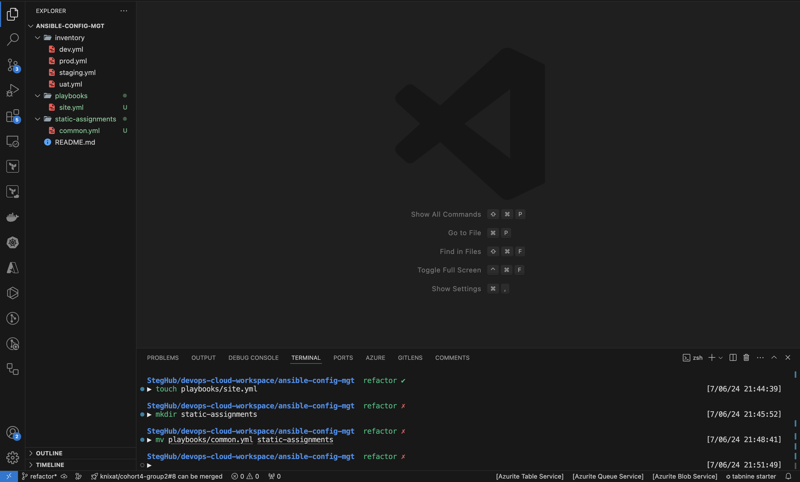

4. Inside `site.yml` file, import `common.yml` playbook.

```yaml
---
- hosts: all
- import_playbook: ../static-assignments/common.yml
```

The code above uses built in `import_playbook` Ansible module.

Your folder structure should look like this;

```css
├── static-assignments
│   └── common.yml
├── inventory
    └── dev
    └── stage
    └── uat
    └── prod
└── playbooks
    └── site.yml
```

__5. Run `ansible-playbook` command against the `dev` environment__

Since you need to apply some tasks to your `dev` servers and `wireshark` is already installed - you can go ahead and create another playbook under `static-assignments` and name it `common-del.yml`.


In this playbook, configure deletion of `wireshark` utility.

```yaml
---
- name: update web, nfs and db servers
  hosts: webservers, nfs, db
  remote_user: ec2-user
  become: yes
  become_user: root
  tasks:
  - name: delete wireshark
    yum:
      name: wireshark
      state: removed

- name: update LB server
  hosts: lb
  remote_user: ubuntu
  become: yes
  become_user: root
  tasks:
  - name: delete wireshark
    apt:
      name: wireshark
      state: absent
      autoremove: yes
      purge: yes
      autoclean: yes
```

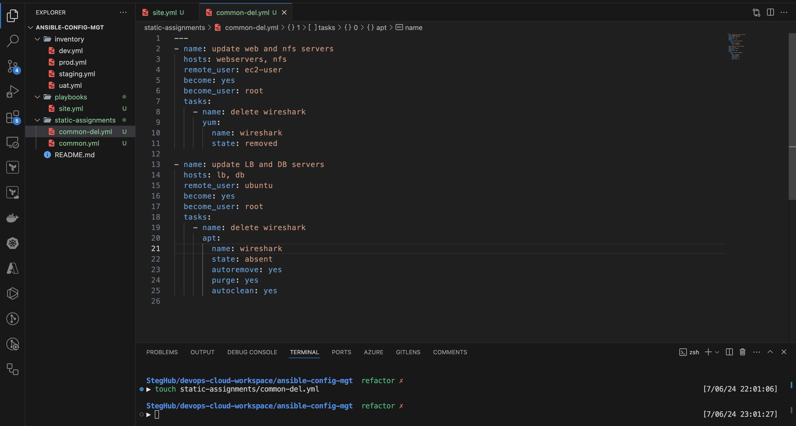

__Update `site.yml` with `- import_playbook: ../static-assignments/common-del.yml` instead of `common.yml`__

```yaml
---
- hosts: all
- import_playbook: ../static-assignments/common-del.yml
```


__Run it against dev servers__

```bash
cd /home/ubuntu/ansible-config-mgt/

ansible-playbook -i inventory/dev.yml playbooks/site.yaml
```
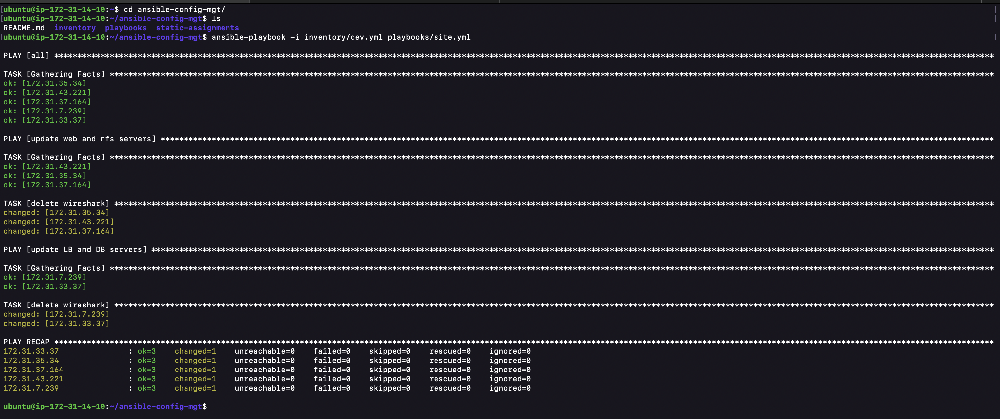

__Esure that wireshark is deleted on all the servers__

__Run__ `wireshark --version` to check

Check the NFS Server


Check Web Server 1


Check Web Server 2


Check DB Server


Check LB Server


Now you have learned how to use import_playbooks module and you have a ready solution to install/delete packages on multiple servers with just one command.


## Step 3 - Configure UAT Webservers with a role `Webserver`

We have our nice and clean dev environment, so let us put it aside and configure 2 new Web Servers as uat. We could write tasks to configure Web Servers in the same playbook, but it would be too messy, instead, we will use a dedicated role to make our configuration reusable.

1. Launch 2 fresh EC2 instances using RHEL 9 image, we will use them as our uat servers, so give them names accordingly - `Web1-UAT` and `Web2-UAT`.


2. To create a role, you must create a directory called `roles/`, relative to the playbook file or in `/etc/ansible/` directory.

There are two ways how you can create this folder structure:

Use an Ansible utility called ansible-galaxy inside `ansible-config-mgt/roles` directory (you need to create `roles` directory upfront)

```basb
mkdir roles
cd roles
ansible-galaxy init webserver
```

__Note__: You can choose either way, but since you store all your codes in GitHub, it is recommended to create folders and files there rather than locally on `Jenkins-Ansible` server.

The entire folder structure should look like below, but if you create it manually - you can skip creating `tests`, `files`, and `vars` or remove them if you used `ansible-galaxy`

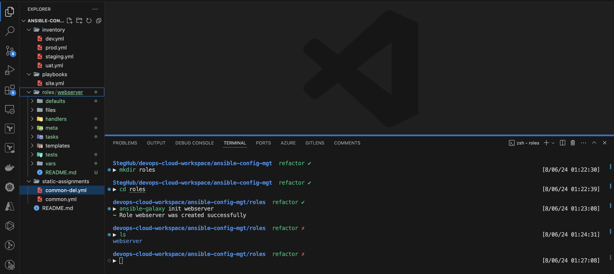

```css
└── webserver
    ├── README.md
    ├── defaults
    │   └── main.yml
    ├── files
    ├── handlers
    │   └── main.yml
    ├── meta
    │   └── main.yml
    ├── tasks
    │   └── main.yml
    ├── templates
    ├── tests
    │   ├── inventory
    │   └── test.yml
    └── vars
        └── main.yml
```
After removing unnecessary directories and files, the roles structure should look like this

```css
└── webserver
    ├── README.md
    ├── defaults
    │   └── main.yml
    ├── handlers
    │   └── main.yml
    ├── meta
    │   └── main.yml
    ├── tasks
    │   └── main.yml
    └── templates
```


3. Update your inventory `ansible-config-mgt/inventory/uat.yml` file with IP addresses of your 2 `UAT Web servers`

__NOTE:__ Ensure you are using ssh-agent to ssh into the `Jenkins-Ansible` instance

```yaml
[uat-webservers]
<Web1-UAT-Server-Private-IP-Address> ansible_ssh_user='ec2-user'
<Web2-UAT-Server-Private-IP-Address> ansible_ssh_user='ec2-user'
```

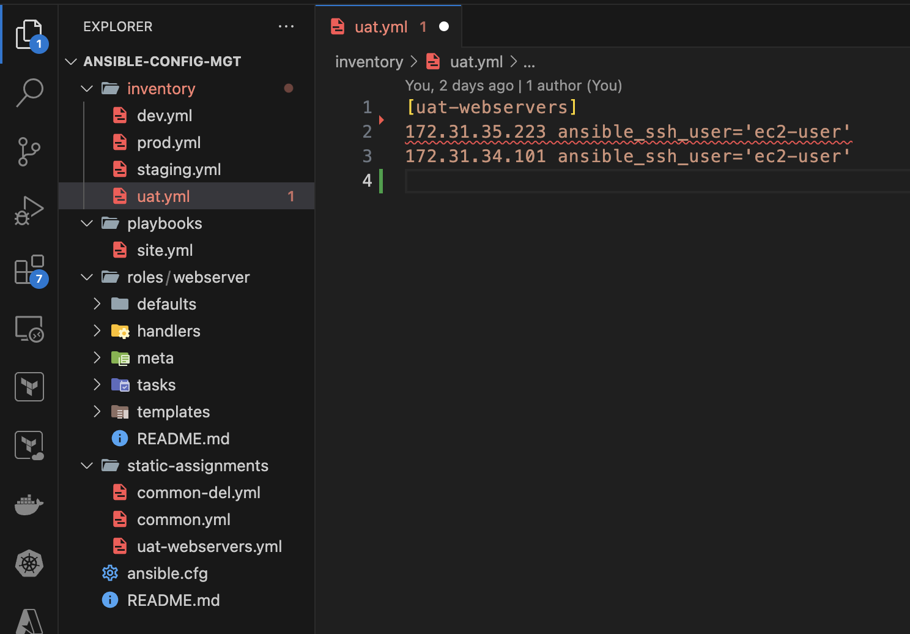

To learn how to setup SSH agent and connect VS Code to your Jenkins-Ansible instance, please see this video:

- For Windows users - [ssh-agent on windows](https://www.youtube.com/watch?v=TYyTXxVWOYA)
- For Linux users - [ssh-agent on linux](https://www.youtube.com/watch?v=EoLrCX1VVog)


4. In /etc/ansible/ansible.cfg file uncomment roles_path string and provide a full path to your roles directory roles_path = /home/ubuntu/ansible-config-mgt/roles, so Ansible could know where to find configured roles.

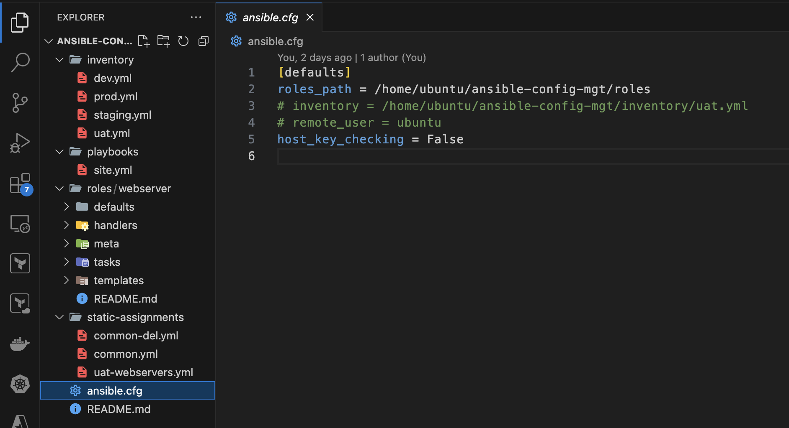

5. It is time to start adding some logic to the webserver role. Go into `tasks` directory, and within the `main.yml` file, start writing configuration tasks to do the following:

- Install and configure Apache (httpd service)
- Clone Tooling website from GitHub https://github.com/<your-name>/tooling.git.
- Ensure the tooling website code is deployed to /var/www/html on each of 2 UAT Web servers.
- Make sure httpd service is started

Your main.yml consist of following tasks:

```yaml
# tasks file for webserver
---
- name: install apache
  remote_user: ec2-user
  become: true
  become_user: root
  ansible.builtin.yum:
    name: "httpd"
    state: present

- name: install git
  remote_user: ec2-user
  become: true
  become_user: root
  ansible.builtin.yum:
    name: "git"
    state: present

- name: clone a repo
  remote_user: ec2-user
  become: true
  become_user: root
  ansible.builtin.git:
    repo: https://github.com/francdomain/tooling.git
    dest: /var/www/html
    force: yes

- name: copy html content to one level up
  remote_user: ec2-user
  become: true
  become_user: root
  command: cp -r /var/www/html/html/ /var/www/

- name: Start service httpd, if not started
  remote_user: ec2-user
  become: true
  become_user: root
  ansible.builtin.service:
    name: httpd
    state: started

- name: recursively remove /var/www/html/html/ directory
  remote_user: ec2-user
  become: true
  become_user: root
  ansible.builtin.file:
    path: /var/www/html/html
    state: absent

```
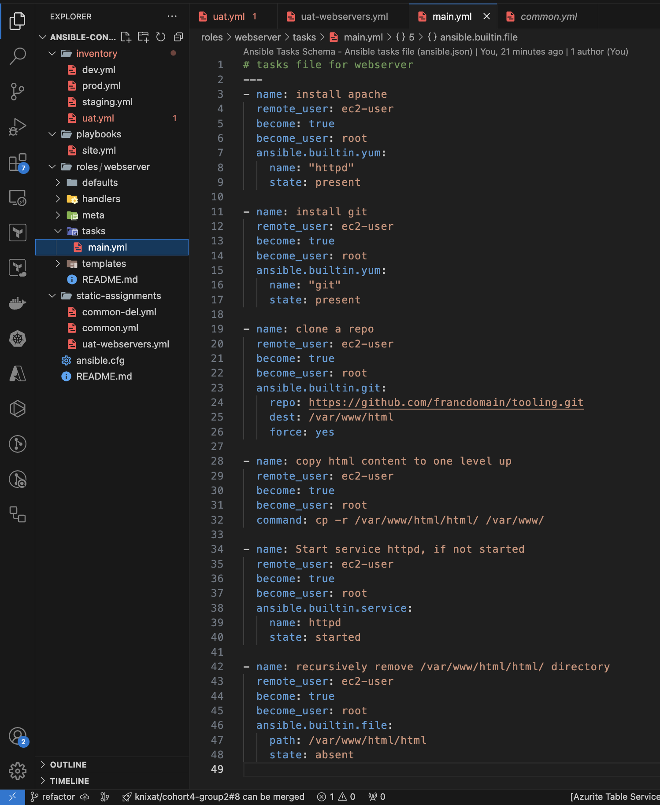


## Step 4 - Reference `Webserver` role

Within the static-assignments folder, create a new assignment for uat-webservers `uat-webservers.yml`. This is where you will reference the role.

```yaml
---
- hosts: uat-webservers
  roles:
     - webserver
```
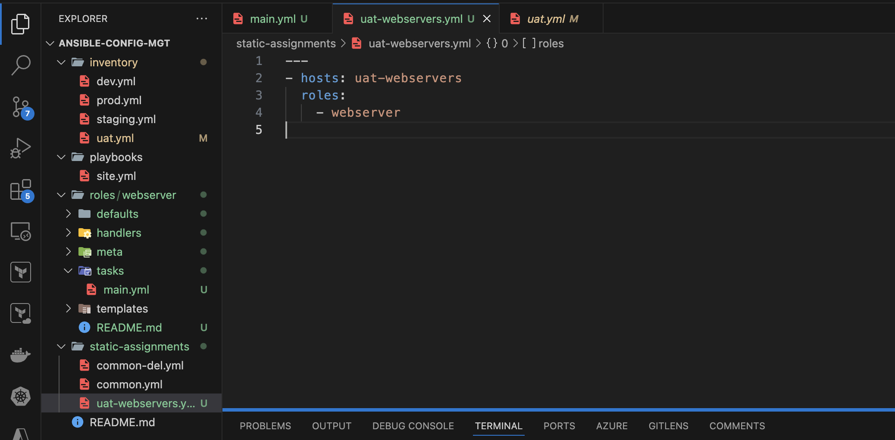

Remember that the entry point to our ansible configuration is the site.yml file. Therefore, you need to refer your `uat-webservers.yml` role inside `site.yml`.

So, we should have this in `site.yml`

```yaml
---
- hosts: all
- import_playbook: ../static-assignments/common.yml

- hosts: uat-webservers
- import_playbook: ../static-assignments/uat-webservers.yml
```
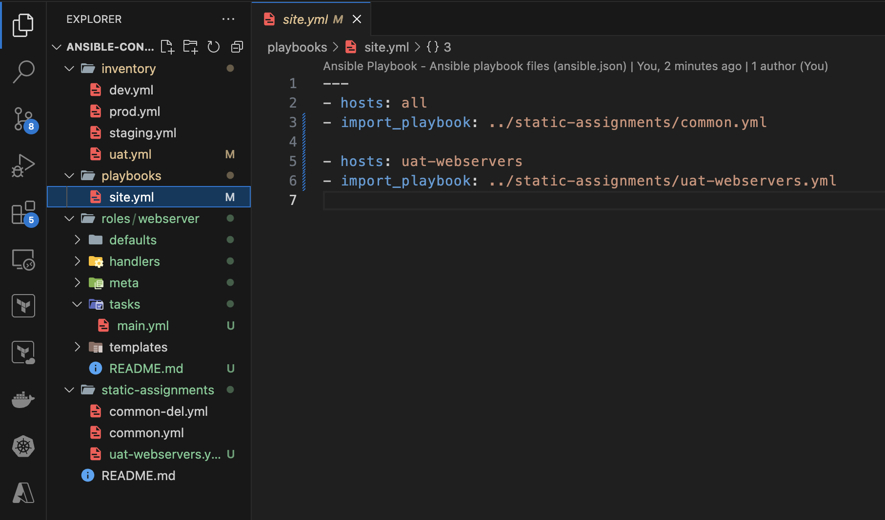


## Step 5 - Commit & Test

Commit your changes, create a Pull Request and `main` them to master branch, make sure webhook triggered two consequent Jenkins jobs, they ran successfully and copied all the files to your `Jenkins-Ansible` server into `/home/ubuntu/ansible-config-artifact/` directory.

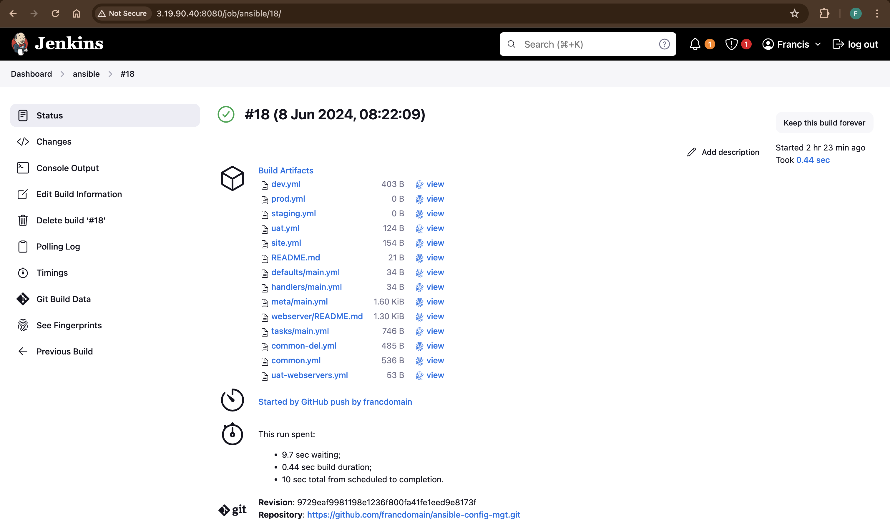


Now run the playbook against your uat inventory and see what happens:

__NOTE:__ Before running your playbook, ensure you have tunneled into your Jenkins-Ansible server via ssh-agent For windows users, see this [video](https://www.youtube.com/watch?v=TYyTXxVWOYA) For [Linux] users, see this [video](https://www.youtube.com/watch?v=EoLrCX1VVog)

```bash
cd /home/ubuntu/ansible-config-artifact

ansible-playbook -i /inventory/uat.yml playbooks/site.yaml
```


You should be able to see both of your UAT Web servers configured and you can try to reach them from your browser:

```html
http://<Web1-UAT-Server-Public-IP-or-Public-DNS-Name>/index.php

or

http://<Web1-UAT-Server-Public-IP-or-Public-DNS-Name>/index.php
```

__Access Web1-UAT__

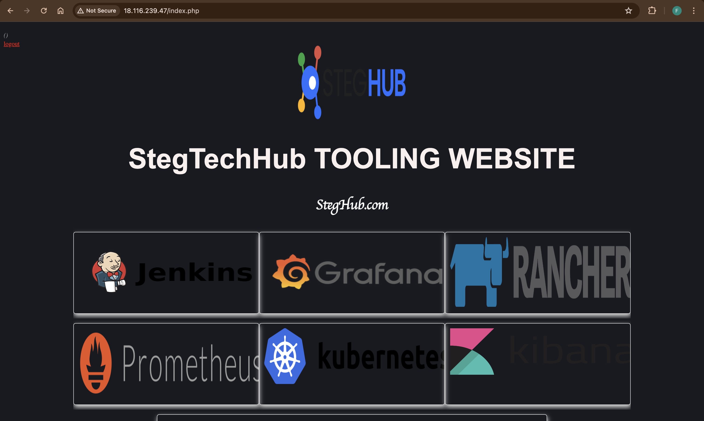

__Access Web2-UAT__


__Our Ansible architecture now looks like this:__


