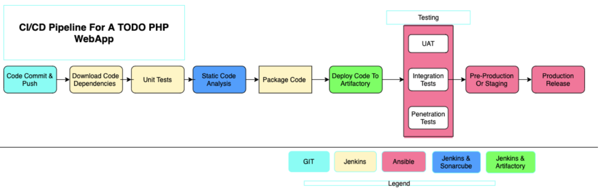
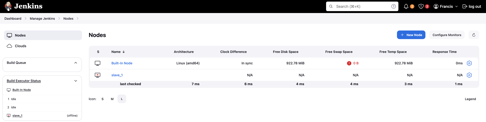

# EXPERIENCE CONTINUOUS INTEGRATION WITH JENKINS | ANSIBLE | ARTIFACTORY | SONARQUBE | PHP

In this project, you will understand and get hands on experience around the entire concept around CI/CD from applications perspective. To fully gain real expertise around this idea, it is best to see it in action across different programming languages and from the platform perspective too. From the application perspective, we will be focusing on PHP here; there are more projects ahead that are based on Java, Node.js, .Net and Python. By the time you start working on Terraform, Docker and Kubernetes projects, you will get to see the platform perspective of CI/CD in action.

## 13 DevOps Success Metrics

1. __Deployment frequency:__ Tracking how often you do deployments is a good DevOps metric. Ultimately, the goal is to do more smaller deployments as often as possible. Reducing the size of deployments makes it easier to test and release. I would suggest counting both production and non-production deployments separately. How often you deploy to QA or pre-production environments is also important. You need to deploy early and often in QA to ensure enough time for testing.

2. __Lead time:__ If the goal is to ship code quickly, this is a key DevOps metric. I would define lead time as the amount of time that occurs between starting on a work item until it is deployed. This helps you know that if you started on a new work item today, how long would it take on average until it gets to production.

3. __Customer tickets:__ The best and worst indicator of application problems is customer support tickets and feedback. The last thing you want is your users reporting bugs or having problems with your software. Because of this, customer tickets also serve as a good indicator of application quality and performance problems.

4. __Percentage of passed automated tests__: To increase velocity, it is highly recommended that the development team makes extensive usage of unit and functional testing. Since DevOps relies heavily on automation, tracking how well automated tests work is a good DevOps metrics. It is good to know how often code changes break tests.

5. __Defect escape rate:__ Do you know how many software defects are being found in production versus QA? If you want to ship code fast, you need to have confidence that you can find software defects before they get to production. Defect escape rate is a great DevOps metric to track how often those defects make it to production.

6. __Availability:__ The last thing we ever want is for our application to be down. Depending on the type of application and how we deploy it, we may have a little downtime as part of scheduled maintenance. It is highly recommended to track this metric and all unplanned outages. Most software companies build status pages to track this. Such as this Google Products Status Page

7. __Service level agreements:__ Most companies have some service level agreement (SLA) that they promise to the customers. It is also important to track compliance with SLAs. Even if there are no formally stated SLAs, there probably are application non-functional requirements or expectations to be met.

8. __Failed deployments:__ We all hope this never happens, but how often do our deployments cause an outage or major issues for the users? Reversing a failed deployment is something we never want to do, but it is something you should always plan for. If you have issues with failed deployments, be sure to track this metric over time. This could also be seen as tracking *Mean Time To Failure (MTTF).

9. __Error rates:__ Tracking error rates within the application is super important. Not only they serve as an indicator of quality problems, but also ongoing performance and uptime related issues. In software development, errors are also known as exceptions, and proper exception handling is critical. If they are not handled nicely, we can figure it out while monitoring the rate of errors.

- __Bugs__ – Identify new exceptions being thrown in the code after a deployment
- __Production issues__ – Capture issues with database connections, query timeouts, and other related issuesPresenting error rate metrics like this simply gives greater insights into where to focus attention.

10. __Application usage & traffic:__ After a deployment, we want to see if the number of transactions or users accessing our system looks normal. If we suddenly have no traffic or a giant spike in traffic, something could be wrong. An attacker may be routing traffic elsewhere, or initiating a DDOS attack

11. __Application performance:__ Before we even perform a deployment, we should configure monitoring tools like Retrace, DataDog, New Relic, or AppDynamics to look for performance problems, hidden errors, and other issues. During and after the deployment, we should also look for any changes in overall application performance and establish some benchmarks to know when things deviate from the norm.

It might be common after a deployment to see major changes in the usage of specific SQL queries, web service or HTTP calls, and other application dependencies. These monitoring tools can provide valuable visualizations like this one below that helps make it easy to spot problems.


12. __Mean time to detection (MTTD):__ When problems happen, it is important that we identify them quickly. The last thing we want is to have a major partial or complete system outage and not know about it. Having robust application monitoring and good observability tools in place will help us detect issues quickly. Once they are detected, we also must fix them quickly!

13. __Mean time to recovery (MTTR):__ This metric helps us track how long it takes to recover from failures. A key metric for the business is keeping failures to a minimum and being able to recover from them quickly. It is typically measured in hours and may refer to business hours, not calendar hours.

These are the major metrics that any DevOps team should track and monitor to understand how well CI/CD process is established and how it helps to deliver quality application to the users.


## Simulating a typical CI/CD Pipeline for a PHP Based application

As part of the ongoing infrastructure development with Ansible started from Project 11, you will be tasked to create a pipeline that simulates continuous integration and delivery. Target end to end CI/CD pipeline is represented by the diagram below. It is important to know that both `Tooling and TODO` Web Applications are based on an interpreted (scripting) language (PHP). It means, it can be deployed directly onto a server and will work without compiling the code to a machine language.

The problem with that approach is, it would be difficult to package and version the software for different releases. And so, in this project, we will be using a different approach for releases, rather than downloading directly from git, we will be using Ansible `uri module`.



## Set Up

To get started, we will focus on these environments initially.

- Ci
- Dev
- Pentest

What we want to achieve, is having Nginx to serve as a reverse proxy for our sites and tools. Each environment setup is represented in the below table and diagrams.


### Common Best Practices of CI/CD

Before we move on to observability metrics - let us list down the principles that define a reliable and robust CI/CD pipeline:

- Maintain a code repository
- Automate build process
- Make builds self-tested
- Everyone commits to the baseline every day
- Every commit to baseline should be built
- Every bug-fix commit should come with a test case
- Keep the build fast
- Test in a clone of production environment
- Make it easy to get the latest deliverables
- Everyone can see the results of the latest build
- Automate deployment (if you are confident enough in your CI/CD pipeline and willing to go for a fully automated Continuous Deployment)

## Project Description:

In this project, we will be setting up a CI/CD Pipeline for a PHP based application. The overall CI/CD process looks like the architecture above.

This project is architected in two major repositories with each repository containing its own CI/CD pipeline written in a Jenkinsfile

- __ansible-config-mgt REPO__: This repository contains JenkinsFile which is responsible for setting up and configuring infrastructure required to carry out processes required for our application to run. It does this through the use of ansible roles. This repo is infrastructure specific

- __PHP-todo REPO__: This repository contains jenkinsfile which is focused on processes which are application build specific such as building, linting, static code analysis, push to artifact repository etc.

## Pre-requisites

Will be making use of AWS virtual machines for this and will require 6 servers for the project which includes:

__Nginx Server:__ This would act as the reverse proxy server to our site and tool.

__Jenkins server:__ To be used to implement your CI/CD workflows or pipelines. Select a t2.medium at least, Ubuntu 20.04 and Security group should be open to port 8080

__SonarQube server:__ To be used for Code quality analysis. Select a t2.medium at least, Ubuntu 20.04 and Security group should be open to port 9000

__Artifactory server:__ To be used as the binary repository where the outcome of your build process is stored. Select a t2.medium at least and Security group should be open to port 8081

__Database server:__ To server as the databse server for the Todo application

__Todo webserver:__ To host the Todo web application.


## Ansible Inventory should look like this

```css
├── ci
├── dev
├── pentest
├── pre-prod
├── prod
├── sit
└── uat
```

ci inventory file

```css
[jenkins]
<Jenkins-Private-IP-Address>

[nginx]
<Nginx-Private-IP-Address>

[sonarqube]
<SonarQube-Private-IP-Address>

[artifact_repository]
<Artifact_repository-Private-IP-Address>
```

dev Inventory file

```css
[tooling]
<Tooling-Web-Server-Private-IP-Address>

[todo]
<Todo-Web-Server-Private-IP-Address>

[nginx]
<Nginx-Private-IP-Address>

[db:vars]
ansible_user=ec2-user
ansible_python_interpreter=/usr/bin/python

[db]
<DB-Server-Private-IP-Address>
```

pentest inventory file

```css
[pentest:children]
pentest-todo
pentest-tooling

[pentest-todo]
<Pentest-for-Todo-Private-IP-Address>

[pentest-tooling]
<Pentest-for-Tooling-Private-IP-Address>
```

Observations:

1. You will notice that in the pentest inventory file, we have introduced a new concept `pentest:children` This is because, we want to have a group called pentest which covers Ansible execution against both `pentest-todo` and `pentest-tooling` simultaneously. But at the same time, we want the flexibility to run specific Ansible tasks against an individual group.
2. The `db` group has a slightly different configuration. It uses a RedHat/Centos Linux distro. Others are based on Ubuntu (in this case user is `ubuntu`). Therefore, the user required for connectivity and path to python interpreter are different. If all your environment is based on Ubuntu, you may not need this kind of set up. Totally up to you how you want to do this. Whatever works for you is absolutely fine in this scenario.

This makes us to introduce another Ansible concept called `group_vars`. With group vars, we can declare and set variables for each group of servers created in the inventory file.

For example, If there are variables we need to be common between both `pentest-todo` and `pentest-tooling`, rather than setting these variables in many places, we can simply use the `group_vars` for pentest. Since in the inventory file it has been created as `pentest:children` Ansible recognizes this and simply applies that variable to both children.

# 1. Install Jenkins

Let's lunch a AWS ec2 with an Ubuntu OS instance and configure the jenkins server on it.


#### Install jenkins and it's dependencies using the terminal.

```bash
sudo apt-get update  # Update the instance

# Download jenkins key
sudo wget -q -O - https://pkg.jenkins.io/debian/jenkins.io.key | sudo apt-key add -

# Add jenkins repository
sudo sh -c 'echo deb http://pkg.jenkins.io/debian-stable binary/ > /etc/apt/sources.list.d/jenkins.list'

# Add jenkins key
sudo apt-key adv --keyserver keyserver.ubuntu.com --recv-keys 5BA31D57EF5975CA

# Install Java
sudo add-apt-repository ppa:openjdk-r/ppa
sudo apt-get update
sudo apt install openjdk-11-jdk

# Install Jenkins
sudo apt-get update
sudo apt-get install jenkins -y

# Enable and start Jenkins
sudo systemctl enable jenkins
sudo systemctl start jenkins
sudo systemctl status jenkins
```


#### Open TCP port 8080


## 2. Installing Blue-Ocean Plugin

Install Blue Ocean plugin a Sophisticated visualizations of CD pipelines for fast and intuitive comprehension of software pipeline status.

Follow the navigation below :

- Go to manage jenkins > manage plugins > available
- Search for BLUE OCEAN PLUGIN and install


## Configure blue ocean pipeline with git repo

Follow the steps below:

- Click "Open blue oceans" plugin and create a new pipeline


- Select github
- Connect github with jenkins using your github personal access token


- Select the repository
- Create the pipeline
Here is our newly created pipeline. It takes the name of your GitHub repository.


At this point you may not have a Jenkinsfile in the Ansible repository, so Blue Ocean will attempt to give you some guidance to create one. But we do not need that. We will rather create one ourselves. So, click on Administration to exit the Blue Ocean console.

## Let us create our `Jenkinsfile`

Inside the Ansible project, create a new directory `deploy` and start a new file `Jenkinsfile` inside the directory.


Add the code snippet below to start building the `Jenkinsfile` gradually. This pipeline currently has just one stage called Build and the only thing we are doing is using the `shell script` module to echo `Building Stage`

```groovy
pipeline {
    agent any


  stages {
    stage('Build') {
      steps {
        script {
          sh 'echo "Building Stage"'
        }
      }
    }
    }
}
```
Now go back into the Ansible pipeline in Jenkins, and select configure,
Scroll down to Build Configuration section and specify the location of the Jenkinsfile at `deploy/Jenkinsfile`


Back to the pipeline again, this time click "Build now"

This will trigger a build and you will be able to see the effect of our basic Jenkinsfile configuration by going through the console output of the build.

To really appreciate and feel the difference of Cloud Blue UI, it is recommended to try triggering the build again from Blue Ocean interface.

1. Click on Open Blue Ocean

2. Select your project

3. Click on the play button against the branch


### Let us see this in action.

1. Create a new git branch and name it `feature/jenkinspipeline-stages`


2. Currently we only have the `Build` stage. Let us add another stage called `Test`. Paste the code snippet below and push the new changes to GitHub.

```groovy
   pipeline {
    agent any

  stages {
    stage('Build') {
      steps {
        script {
          sh 'echo "Building Stage"'
        }
      }
    }

    stage('Test') {
      steps {
        script {
          sh 'echo "Testing Stage"'
        }
      }
    }
    }
}
```
Push the new changes to GitHub


3. To make your new branch show up in Jenkins, we need to tell Jenkins to scan the repository
i. Click on the "Administration" button
ii. Navigate to the Ansible project and click on "Scan repository now"


iii. Refresh the page and both branches will start building automatically. You can go into Blue Ocean and see both branches there too.


iv. In Blue Ocean, you can now see how the `Jenkinsfile` has caused a new step in the pipeline launch build for the new branch.


## A QUICK TASK

1. Create a pull request to merge the latest code into the `main branch`


Merge the PR


2. After merging the `PR`, go back into your terminal and switch into the `main` branch.
3. Pull the latest change.


4. Create a new branch, add more stages into the Jenkins file to simulate below phases. (Just add an `echo` command like we have in `build` and `test` stages)
   1. Package
   2. Deploy
   3. Clean up


5. Verify in Blue Ocean that all the stages are working, then merge your feature branch to the main branch

6. Eventually, your main branch should have a successful pipeline like this in blue ocean


# Running Ansible Playbook from Jenkins

Now that you have a broad overview of a typical Jenkins pipeline. Let us get the actual Ansible deployment to work by:

1. Installing Ansible on Jenkins

```bash
sudo apt update

sudo apt install ansible

ansible --version
```


2. Installing Ansible plugin in Jenkins UI


3. Creating `Jenkinsfile` from scratch. (Delete all you currently have in there and start all over to get Ansible to run successfully)

```groovy
pipeline {
    agent any

    environment {
        ANSIBLE_CONFIG = "${WORKSPACE}/deploy/ansible.cfg"
    }

    stages {
        stage('Initial cleanup') {
            steps {
                dir("${WORKSPACE}") {
                    deleteDir()
                }
            }
        }

        stage('Checkout SCM') {
            steps {
                git branch: 'main', url: 'https://github.com/francdomain/ansible-config-mgt.git'
            }
        }

        stage('Prepare Ansible For Execution') {
            steps {
                sh 'echo ${WORKSPACE}'
                sh 'sed -i "3 a roles_path=${WORKSPACE}/roles" ${WORKSPACE}/deploy/ansible.cfg'
            }
        }

        stage('Test SSH Connections') {
            steps {
                script {
                    def allHosts = [
                        'ubuntu@172.31.89.253',
                        'ubuntu@172.31.91.227',
                        'ec2-user@172.31.81.236',
                        'ec2-user@172.31.85.118'
                    ]

                    sshagent(['private-key']) {
                        allHosts.each { host ->
                            sh "ssh -o StrictHostKeyChecking=no ${host} exit"
                        }
                    }
                }
            }
        }

        stage('Run Ansible playbook') {
            steps {
                sshagent(['private-key']) {
                    ansiblePlaybook(
                        become: true,
                        credentialsId: 'private-key',
                        disableHostKeyChecking: true,
                        installation: 'ansible',
                        inventory: '${WORKSPACE}/inventory/dev.yml',
                        playbook: '${WORKSPACE}/playbooks/site.yml'
                    )
                }
            }
        }

        stage('Clean Workspace after build') {
            steps {
                cleanWs(cleanWhenAborted: true, cleanWhenFailure: true, cleanWhenNotBuilt: true, cleanWhenUnstable: true, deleteDirs: true)
            }
        }
    }
}
```


## Note: Ensure that Ansible runs against the Dev environment successfully.

__Possible errors to watch out for:__

1. Ensure that the git module in Jenkinsfile is checking out SCM to `main` branch instead of `master` (GitHub has discontinued the use of Master due to Black Lives Matter. You can read more here)

2. Jenkins needs to export the ANSIBLE_CONFIG environment variable. You can put the .ansible.cfg file alongside Jenkinsfile in the deploy directory. This way, anyone can easily identify that everything in there relates to deployment. Then, using the Pipeline Syntax tool in Ansible, generate the syntax to create environment variables to set. https://wiki.jenkins.io/display/JENKINS/Building+a+software+project


__Possible issues to watch out for when you implement this__

1. Remember that ansible.cfg must be exported to environment variable so that Ansible knows where to find Roles. But because you will possibly run Jenkins from different git branches, the location of Ansible roles will change. Therefore, you must handle this dynamically. You can use Linux Stream Editor sed to update the section roles_path each time there is an execution. You may not have this issue if you run only from the main branch.

2. If you push new changes to Git so that Jenkins failure can be fixed. You might observe that your change may sometimes have no effect. Even though your change is the actual fix required. This can be because Jenkins did not download the latest code from GitHub. Ensure that you start the Jenkinsfile with a clean up step to always delete the previous workspace before running a new one. Sometimes you might need to login to the Jenkins Linux server to verify the files in the workspace to confirm that what you are actually expecting is there. Otherwise, you can spend hours trying to figure out why Jenkins is still failing, when you have pushed up possible changes to fix the error.

3. Another possible reason for Jenkins failure sometimes, is because you have indicated in the `Jenkinsfile` to check out the `main` git branch, and you are running a pipeline from another branch. So, always verify by logging onto the Jenkins box to check the workspace, and run `git branch` command to confirm that the branch you are expecting is there.

If everything goes well for you, it means, the `Dev` environment has an up-to-date configuration.

## Install Ansible


## Configure ansible on Jenkins

Click on Dashboard > Manage Jenkins > Global Tool Configuration > Add Ansible. Add a name and the path ansible is installed on the jenkins server.


### To ensure jenkins properly connects to all servers, install another plugin called `ssh agent`


### Then go to `manage jenkins > credentials > global > add credentials`
Then follow the steps below:

- Kind: SSH Username with private key
- Scope: Global (Jenkins, nodes, items, all child items, etc)
-	ID: private-key (or any ID you prefer)
-	Username: Leave it blank or set a default value (e.g., defaultuser) # This is because we are using servers of different username i.e ubbuntu and ec2-user. This value won’t be used because the actual usernames will be specified in the Ansible inventory file.
-	Private Key: Enter the private key directly


## Update inventory/dev.yml by specifying the private IP address of the servers


### Update the playbook as well


## Run Ansible against the Dev environment


# Parameterizing Jenkinsfile For Ansible Deployment

To deploy to other environments, we will need to use parameters.
1. Update `sit` inventory with new servers (`inventory/sit.yml`)

```yaml
[tooling]
<SIT-Tooling-Web-Server-Private-IP-Address>

[todo]
<SIT-Todo-Web-Server-Private-IP-Address>

[nginx]
<SIT-Nginx-Private-IP-Address>

[db:vars]
ansible_user=ec2-user
ansible_python_interpreter=/usr/bin/python

[db]
<SIT-DB-Server-Private-IP-Address>
```


2. Update Jenkinsfile to introduce parameterization. Below is just one parameter. It has a default value in case if no value is specified at execution.

```groovy
pipeline {
    agent any

    parameters {
      string(name: 'inventory', defaultValue: 'dev',  description: 'This is the inventory file for the environment to deploy configuration')
    }
...
```


3. In the Ansible execution section, remove the hardcoded inventory/dev and replace with `${inventory}


- Notice the `Build Now` has changed to `Build with Parameters` and this enables us to run differenet environment easily.
The default value loads up, but we can now specify which environment we want to deploy the configuration to. Simply type sit and hit Run


- View it from Blue Ocean


4. Add another parameter. This time, introduce tagging in Ansible. You can limit the Ansible execution to a specific role or playbook desired. Therefore, add an Ansible tag to run against `webserver` only. Test this locally first to get the experience. Once you understand this, update `Jenkinsfile` and run it from Jenkins.

- Update `playbook/site.yml` with tags


- Add another parameter to the jenkinsfile. Name the parameter `ansible_tags` and the default value `webserver`

```groovy
string(name: 'ansible_tags', defaultValue: 'webserver', description: 'Ansible tags to run specific roles or tasks')
```


- Update the Ansible execution section to prompt for tag


- Click on the play button and update the inventory field to `sit` and the ansible_tags to `webserver`


- Click on `Run` to run the build


### To avoid hardcoding values in the Jenkinsfile, we can parameterize several more elements. Here are some suggestions:

1.	SCM (Source Control Management) URL and Branch:
Parameterize the repository URL and the branch to allow flexibility in changing repositories and branches without modifying the Jenkinsfile.
2.	SSH Hosts:
Parameterize the list of SSH hosts. This will enable you to specify different hosts for different environments or scenarios.
3.	Ansible Playbook Path:
Parameterize the playbook path to allow different playbooks to be specified.
4.	Credentials ID:
Parameterize the credentials ID used for SSH and Ansible to support different credentials for different environments.
5.	Role Path:
The roles path in the Ansible configuration can be parameterized as well.

```groovy
pipeline {
    agent any

    environment {
        ANSIBLE_CONFIG = "${WORKSPACE}/deploy/ansible.cfg"
    }

    parameters {
        string(name: 'inventory', defaultValue: 'dev', description: 'This is the inventory file for the environment to deploy configuration')
        string(name: 'branch', defaultValue: 'main', description: 'Branch to checkout')
        string(name: 'repo_url', defaultValue: 'https://github.com/francdomain/ansible-config-mgt.git', description: 'Repository URL')
        text(name: 'ssh_hosts', defaultValue: 'ubuntu@172.31.89.253\nubuntu@172.31.91.227\nec2-user@172.31.81.236\nec2-user@172.31.85.118', description: 'List of SSH hosts, one per line')
        string(name: 'playbook_path', defaultValue: '${WORKSPACE}/playbooks/site.yml', description: 'Path to the Ansible playbook')
        string(name: 'credentials_id', defaultValue: 'private-key', description: 'Credentials ID for SSH and Ansible')
    }

    stages {
        stage('Initial cleanup') {
            steps {
                dir("${WORKSPACE}") {
                    deleteDir()
                }
            }
        }

        stage('Checkout SCM') {
            steps {
                git branch: "${params.branch}", url: "${params.repo_url}"
            }
        }

        stage('Prepare Ansible For Execution') {
            steps {
                sh 'echo ${WORKSPACE}'
                sh 'sed -i "3 a roles_path=${WORKSPACE}/roles" ${WORKSPACE}/deploy/ansible.cfg'
            }
        }

        stage('Test SSH Connections') {
            steps {
                script {
                    def allHosts = params.ssh_hosts.split('\n')

                    sshagent([params.credentials_id]) {
                        allHosts.each { host ->
                            sh "ssh -o StrictHostKeyChecking=no ${host} exit"
                        }
                    }
                }
            }
        }

        stage('Run Ansible playbook') {
            steps {
                sshagent([params.credentials_id]) {
                    ansiblePlaybook(
                        become: true,
                        credentialsId: params.credentials_id,
                        disableHostKeyChecking: true,
                        installation: 'ansible',
                        inventory: "${WORKSPACE}/inventory/${params.inventory}",
                        playbook: params.playbook_path
                    )
                }
            }
        }

        stage('Clean Workspace after build') {
            steps {
                cleanWs(cleanWhenAborted: true, cleanWhenFailure: true, cleanWhenNotBuilt: true, cleanWhenUnstable: true, deleteDirs: true)
            }
        }
    }
}
```


# CI/CD Pipline for TODO Application

We already have `tooling` website as a part of deployment through Ansible. Here we will introduce another PHP application to add to the list of software products we are managing in our infrastructure. The good thing with this particular application is that it has unit tests, and it is an ideal application to show an end-to-end CI/CD pipeline for a particular application.

### Todo Project files path
```css
/path/to/your/laravel/project
├── app
│   ├── Console
│   ├── Exceptions
│   ├── Http
│   │   ├── Controllers
│   │   ├── Middleware
│   ├── Models
│   ├── Providers
├── bootstrap
│   ├── cache
├── config
│   ├── app.php
│   ├── database.php
│   └── ...
├── database
│   ├── factories
│   ├── migrations
│   ├── seeders
├── public
│   ├── index.php
│   ├── css
│   ├── js
│   ├── ...
├── resources
│   ├── js
│   ├── lang
│   ├── views
│   └── ...
├── routes
│   ├── api.php
│   ├── channels.php
│   ├── console.php
│   ├── web.php
├── storage
│   ├── app
│   ├── framework
│   ├── logs
├── tests
│   ├── Feature
│   ├── Unit
├── vendor
├── .env
├── artisan
├── composer.json
├── composer.lock
├── package.json
├── phpunit.xml
└── webpack.mix.js
```

Our goal here is to deploy the application onto servers directly from `Artifactory` rather than from `git` `If you have not updated Ansible with an Artifactory role`, simply use this guide to create an Ansible role for Artifactory (ignore the Nginx part). [Configure Artifactory on Ubuntu 20.04](https://www.atlantic.net/dedicated-server-hosting/how-to-install-jfrog-artifactory-on-ubuntu-22-04/)

## Create an Ansible role for Artifactory

### Prerequests

- Ensure port 8082 is opened in artifactory server

### Install Artifactory role using Ansible galaxy collection

```
ansible-galaxy collection install jfrog.platform
```


### Update Artifactory role in `roles/artifactory/tasks/main.yml` to install jfrog Artifactory


- Update `playbook/site.yml`


- Update `inventory/ci.yml`


### Run the playbook against ci.yml to install `jfrog artifactory`


Access the artifactory GUI on a browser with `http://<server public IP address>:8082`. Use the default authentication credentials: `admin` and `password` to login.


Create a local repository `Todo-artifact-local`


# Phase 1 – Prepare Jenkins

## 1. Fork the repository below into your GitHub account

```bash
https://github.com/StegTechHub/php-todo.git
```


## 2. On your Jenkins server, install PHP, its dependencies and Composer tool (Feel free to do this manually at first, then update your Ansible accordingly later)

```bash
sudo apt update

# Install dependancies
sudo apt install -y zip libapache2-mod-php phploc php-{xml,bcmath,bz2,intl,gd,mbstring,mysql,zip}

# Download the installer to the current directory
php -r "copy('https://getcomposer.org/installer', 'composer-setup.php');"

# Install Composer Globally
sudo php composer-setup.php --install-dir=/usr/local/bin --filename=composer

# Remove the Installer
php -r "unlink('composer-setup.php');"

# Verify Installation version
php -v
composer -v
```


The `php version` installed by the composer is `8.3.6` while the php version of the `todo application` is `7.4`. Ensure to remove the current version and [install php 7.4](https://www.digitalocean.com/community/questions/how-to-update-the-php-to-7-4) and its dependencies to avoid error.

## 3. Install Jenkins plugins

- Plot plugin


- Artifactory plugin


- We will use plot plugin to display tests reports, and code coverage information.
- The Artifactory plugin will be used to easily upload code artifacts into an Artifactory server.

## 4. In Jenkins UI configure Artifactory

- Configure the server ID, URL and Credentials, run Test Connection.


# Phase 2 - Integrate Artifactory repository with Jenkins

1. Create a dummy Jenkinsfile in the repository
2. Using Blue Ocean, create a multibranch Jenkins pipeline


## 3. On the database server, create database and user
   - In jenkins server Install my sql client

```bash
sudo apt install mysql-client -y
```
  - Create database and user on database server

```sql
Create database homestead;
CREATE USER 'homestead'@'%' IDENTIFIED BY 'sePret^i';
GRANT ALL PRIVILEGES ON * . * TO 'homestead'@'%';
```
- Update mysql role in `roles/mysql/vars/main.yml`


- Run ansible with jenkins to create the database


- Verify that database has benn created


## 4. Update the database connectivity requirements in the file .env.sample

```css
APP_ENV=local
APP_DEBUG=true
LOG_LEVEL=debug
APP_KEY=SomeRandomString
APP_URL=http://localhost

DB_HOST=172.31.91.227
DB_DATABASE=homestead
DB_USERNAME=homestead
DB_PASSWORD=sePret^i
DB_CONNECTION=mysql
BD_PORT=3306

CACHE_DRIVER=file
SESSION_DRIVER=file
QUEUE_DRIVER=sync

REDIS_HOST=127.0.0.1
REDIS_PASSWORD=null
REDIS_PORT=6379

MAIL_DRIVER=smtp
MAIL_HOST=mailtrap.io
MAIL_PORT=2525
MAIL_USERNAME=null
MAIL_PASSWORD=null
MAIL_ENCRYPTION=null
```

## 5. Update Jenkinsfile with proper pipeline configuration

```groovy
pipeline {
    agent any

  stages {

     stage("Initial cleanup") {
          steps {
            dir("${WORKSPACE}") {
              deleteDir()
            }
          }
        }

    stage('Checkout SCM') {
      steps {
            git branch: 'main', url: 'https://github.com/StegTechHub/php-todo.git'
      }
    }

    stage('Prepare Dependencies') {
      steps {
             sh 'mv .env.sample .env'
             sh 'composer install'
             sh 'php artisan migrate'
             sh 'php artisan db:seed'
             sh 'php artisan key:generate'
      }
    }
  }
}
```

__Notice__ the `Prepare Dependencies` section

- The required file by PHP is `.env` so we are renaming .env.sample to .env
- Composer is used by PHP to install all the dependent libraries used by the application
- `php artisan` uses the `.env` file to setup the required database objects - (After successful run of this step, login to the database, run show tables and you will see the tables being created for you)

- Update the Jenkinsfile to include Unit tests step

  - Ensure that all neccesary php extensions are already installed.
  - Run the pipeline build , you will notice that the database has been populated with tables using a method in laravel known as `migration` and `seeding`.

### Install `phpunit`


### Install `phploc`


- __Update Jenkinsfile to include Unit tests__

```groovy
stage('Execute Unit Tests') {
      steps {
             sh './vendor/bin/phpunit'
      }
```
- Run the pipieline


- __After successful run, login to the database__.

```sql
sudo mysql
```
- __Run show tables and you will see the tables being created__.


- Set the bind address


# Phase 3 - Code Quality Analysis

This is one of the areas where developers, architects and many stakeholders are mostly interested in as far as product development is concerned. As a DevOps engineer, you also have a role to play. Especially when it comes to setting up the tools.

For PHP the most commonly tool used for code quality analysis is [phploc](https://phpqa.io/projects/phploc.html). [Read the article here for more](https://matthiasnoback.nl/2019/09/using-phploc-for-quick-code-quality-estimation-part-1/)

The data produced by `phploc` can be ploted onto graphs in Jenkins.

1. Add the code analysis step in Jenkinsfile. The output of the data will be saved in build/logs/phploc.csv file.

```groovy
stage('Code Analysis') {
      steps {
            sh 'phploc app/ --log-csv build/logs/phploc.csv'

      }
    }
```
2. Plot the data using plot Jenkins plugin.
This plugin provides generic plotting (or graphing) capabilities in Jenkins. It will plot one or more single values variations across builds in one or more plots. Plots for a particular job (or project) are configured in the job configuration screen, where each field has additional help information. Each plot can have one or more lines (called data series). After each build completes the plots' data series latest values are pulled from the CSV file generated by phploc.


- Run the pipeline and View the Plot chart in Jenkins


### 3. Bundle the application code for into an artifact (archived package) upload to Artifactory

```groovy
stage ('Package Artifact') {
    steps {
            sh 'zip -qr php-todo.zip ${WORKSPACE}/*'
     }
    }
```
### 4. Publish the resulted artifact into Artifactory

```groovy
stage ('Upload Artifact to Artifactory') {
          steps {
            script {
                 def server = Artifactory.server 'artifactory-server'
                 def uploadSpec = """{
                    "files": [
                      {
                       "pattern": "php-todo.zip",
                       "target": "<name-of-artifact-repository>/php-todo",
                       "props": "type=zip;status=ready"

                       }
                    ]
                 }"""

                 server.upload spec: uploadSpec
               }
            }

        }
```
### 5. Deploy the application to the dev environment by launching Ansible pipeline

```groovy
stage ('Deploy to Dev Environment') {
    steps {
    build job: 'ansible-project/main', parameters: [[$class: 'StringParameterValue', name: 'env', value: 'dev']], propagate: false, wait: true
    }
  }
```


### Create a task to set up the Dev environment and deploy artifact to webserver (todo server)

```yaml
# # tasks file for webserver - php-todo
---
# Install Apache
- name: Install Apache
  remote_user: ec2-user
  become: true
  ansible.builtin.yum:
    name: httpd
    state: present

# Install EPEL release
- name: Install EPEL release
  remote_user: ec2-user
  become: true
  ansible.builtin.yum:
    name: https://dl.fedoraproject.org/pub/epel/epel-release-latest-9.noarch.rpm
    state: present

# Install dnf-utils and Remi repository
- name: Install dnf-utils and Remi repository
  remote_user: ec2-user
  become: true
  ansible.builtin.yum:
    name:
      - dnf-utils
      - http://rpms.remirepo.net/enterprise/remi-release-9.rpm
    state: present

# Reset PHP module
- name: Reset PHP module
  remote_user: ec2-user
  become: true
  ansible.builtin.command:
    cmd: dnf module reset php -y

# Enable PHP 7.4 module
- name: Enable PHP 7.4 module
  remote_user: ec2-user
  become: true
  ansible.builtin.command:
    cmd: dnf module enable php:remi-7.4 -y

# Install PHP and extensions
- name: Install PHP and extensions
  remote_user: ec2-user
  become: true
  ansible.builtin.yum:
    name:
      - php
      - php-opcache
      - php-gd
      - php-curl
      - php-mysqlnd
      - php-common
      - php-mbstring
      - php-intl
      - php-xml
      - php-fpm
      - php-json
    state: present
    enablerepo: remi-7.4

# Ensure PHP-FPM service is started and enabled
- name: Ensure PHP-FPM service is started and enabled
  remote_user: ec2-user
  become: true
  ansible.builtin.service:
    name: php-fpm
    state: started
    enabled: true

# Set SELinux boolean for httpd_execmem
- name: Set SELinux boolean for httpd_execmem
  remote_user: ec2-user
  become: true
  ansible.builtin.seboolean:
    name: httpd_execmem
    state: true
    persistent: yes

# Ensure httpd service is started and enabled
- name: Ensure httpd service is started and enabled
  remote_user: ec2-user
  become: true
  ansible.builtin.service:
    name: httpd
    state: started
    enabled: true

# Download the artifact
- name: Download the artifact
  remote_user: ec2-user
  become: true
  ansible.builtin.get_url:
    url: http://54.88.110.0:8082/artifactory/Todo-artifact-local/php-todo.zip
    dest: /home/ec2-user/php-todo.zip
    url_username: admin
    url_password: Admin123$

- name: Ensure unzip is installed
  become: yes
  ansible.builtin.yum:
    name: unzip
    state: present
  when: ansible_os_family == "RedHat"

- name: Unzip the artifacts
  ansible.builtin.unarchive:
    src: /home/ec2-user/php-todo.zip
    dest: /var/www/html/
    remote_src: yes

# Unzip the artifacts
- name: Unzip the artifacts
  ansible.builtin.unarchive:
    src: /home/ec2-user/php-todo.zip
    dest: /home/ec2-user/
    remote_src: yes
  become: true

# Run chown on /var/www/html
- name: Run chown on /var/www/html
  ansible.builtin.command:
    cmd: chown -R $USER:$USER /var/www/html
  become: true

# Deploy the code
- name: Deploy the code
  remote_user: ec2-user
  become: true
  ansible.builtin.copy:
    src: /home/ec2-user/var/lib/jenkins/workspace/php-todo-pipeline/.
    dest: /var/www/html/
    force: yes
    remote_src: yes

# Delete the zip file after unzipping
- name: Delete the zip file after unzipping
  ansible.builtin.file:
    path: /home/ec2-user/php-todo.zip
    state: absent
  become: true

# Delete the unzipped files after copying
- name: Delete the unzipped files after copying
  ansible.builtin.file:
    path: /home/ec2-user/php-todo/
    state: absent
  become: true

# Remove Apache default welcome page on RedHat-based systems
- name: Remove Apache default welcome page
  remote_user: ec2-user
  become: true
  ansible.builtin.file:
    path: /etc/httpd/conf.d/welcome.conf
    state: absent
  when: ansible_os_family == "RedHat"

# Restart httpd
- name: Restart httpd
  remote_user: ec2-user
  become: true
  ansible.builtin.service:
    name: httpd
    state: restarted

# Verify PHP version
- name: Verify PHP version
  remote_user: ec2-user
  become: true
  ansible.builtin.command: php -v
  register: php_version

# Display PHP version
- name: Display PHP version
  remote_user: ec2-user
  become: true
  ansible.builtin.debug:
    msg: "{{ php_version.stdout }}"

# Set SELinux context for web directory and PHP files
- name: Set SELinux context for web directory
  remote_user: ec2-user
  become: true
  ansible.builtin.command:
    cmd: chcon -R -t httpd_sys_content_t /var/www/html

- name: Set SELinux context for PHP writable files
  remote_user: ec2-user
  become: true
  ansible.builtin.command:
    cmd: chcon -R -t httpd_sys_rw_content_t /var/www/html

# Generate a new APP_KEY if missing or invalid
- name: Generate a new APP_KEY if missing or invalid
  remote_user: ec2-user
  become: true
  ansible.builtin.command:
    cmd: php artisan key:generate
  args:
    chdir: /var/www/html

# Clear the configuration cache
- name: Clear the configuration cache
  remote_user: ec2-user
  become: true
  ansible.builtin.command:
    cmd: php artisan config:cache
  args:
    chdir: /var/www/html

# Ensure .env file and config directory have correct permissions
- name: Ensure .env file and config directory have correct permissions - chown
  remote_user: ec2-user
  become: true
  ansible.builtin.command:
    cmd: chown -R apache:apache /var/www/html/

- name: Ensure .env file and config directory have correct permissions - chmod
  remote_user: ec2-user
  become: true
  ansible.builtin.command:
    cmd: chmod -R 775 /var/www/html/

# Restart the web server and PHP-FPM
- name: Restart the web server
  remote_user: ec2-user
  become: true
  ansible.builtin.service:
    name: httpd
    state: restarted

- name: Restart PHP-FPM
  remote_user: ec2-user
  become: true
  ansible.builtin.service:
    name: php-fpm
    state: restarted
```


- Run the pipeline


- Check the artifactory for the uploaded artifact (`php-todo.zip`)


### Visit a browser using the publis IP address to access the todo application


### We need to configure SonarQube - An open-source platform developed by SonarSource for continuous inspection of code quality to perform automatic reviews with static analysis of code to detect bugs, code smells, and security vulnerabilities.

# SonarQube Installation

## Install SonarQube on Ubuntu 20.04 With PostgreSQL as Backend Database

Here is a manual approach to installation. Ensure that you can to automate the same with Ansible.

Below is a step by step guide how to install SonarQube 7.9.3 version. It has a strong prerequisite to have Java installed since the tool is Java-based. MySQL support for SonarQube is deprecated, therefore we will be using PostgreSQL.

We will make some Linux Kernel configuration changes to ensure optimal performance of the tool - we will increase `vm.max_map_count`, file discriptor and ulimit.

- __Tune Linux Kernel__

This can be achieved by making session changes which does not persist beyond the current session terminal.

```bash
sudo sysctl -w vm.max_map_count=262144
sudo sysctl -w fs.file-max=65536
ulimit -n 65536
ulimit -u 4096
```
- __To make a permanent change, edit the file /etc/security/limits.conf and append the below__

```bash
sonarqube   -   nofile   65536
sonarqube   -   nproc    4096
```
- __Before installing, let us update and upgrade system packages__

```bash
sudo apt-get update
sudo apt-get upgrade
```
- __Install wget and unzip packages__

```bash
sudo apt-get install wget unzip -y
```

- __Install OpenJDK and Java Runtime Environment (JRE) 11__

```bash
sudo apt-get install openjdk-11-jdk -y
sudo apt-get install openjdk-11-jre -y
```
- __Set default JDK - To set default JDK or switch to OpenJDK enter below command:__

```bash
sudo update-alternatives --config java
```
If you have multiple versions of Java installed, you should see a list like below:

__Output__
```bash
Selection    Path                                            Priority   Status

------------------------------------------------------------

  0            /usr/lib/jvm/java-11-openjdk-amd64/bin/java      1111      auto mode

  1            /usr/lib/jvm/java-11-openjdk-amd64/bin/java      1111      manual mode

  2            /usr/lib/jvm/java-8-openjdk-amd64/jre/bin/java   1081      manual mode

* 3            /usr/lib/jvm/java-8-oracle/jre/bin/java          1081      manual mode
```

__Type "1" to switch OpenJDK 11__

- __Verify the set JAVA Version:__
```bash
java -version
```

## Install and Setup PostgreSQL 10 Database for SonarQube

- The command below will add PostgreSQL repo to the repo list:

```bash
sudo sh -c 'echo "deb http://apt.postgresql.org/pub/repos/apt/ `lsb_release -cs`-pgdg main" >> /etc/apt/sources.list.d/pgdg.list'
```
- Download PostgreSQL software

```bash
wget -q https://www.postgresql.org/media/keys/ACCC4CF8.asc -O - | sudo apt-key add -
```
- Start PostgreSQL Database Server

```bash
sudo systemctl start postgresql
```
- Enable it to start automatically at boot time

```bash
sudo systemctl enable postgresql
```


-Change the password for default postgres user (Pass in the password you intend to use, and remember to save it somewhere)

```bash
su - postgres
```
- Create a new user by typing

```sql
createuser sonar
```


- Switch to the PostgreSQL shell

```sql
psql
```
- Set a password for the newly created user for SonarQube database

```sql
ALTER USER sonar WITH ENCRYPTED password 'sonar';
```
- Create a new database for PostgreSQL database by running:

```sql
CREATE DATABASE sonarqube OWNER sonar;
```
- Grant all privileges to sonar user on sonarqube Database.

```sql
grant all privileges on DATABASE sonarqube to sonar;
```
- Exit from the psql shell:

```sql
\q
```

### Install SonarQube on Ubuntu 20.04 LTS

- Navigate to the tmp directory to temporarily download the installation files

```bash
cd /tmp && sudo wget https://binaries.sonarsource.com/Distribution/sonarqube/sonarqube-7.9.3.zip
```
- Unzip the archive setup to /opt directory

```bash
sudo unzip sonarqube-7.9.3.zip -d /opt
```
- Move extracted setup to /opt/sonarqube directory

```bash
sudo mv /opt/sonarqube-7.9.3 /opt/sonarqube
```
## Configure SonarQube

We cannot run SonarQube as a root user, if you run using root user it will stop automatically. The ideal approach will be to create a separate group and a user to run SonarQube

- Create a group sonar

```bash
sudo groupadd sonar
```
- Now add a user with control over the `/opt/sonarqube` directory

```bash
sudo useradd -c "user to run SonarQube" -d /opt/sonarqube -g sonar sonar
sudo chown sonar:sonar /opt/sonarqube -R
```
- Open SonarQube configuration file using your favourite text editor (e.g., nano or vim)

```bash
sudo vim /opt/sonarqube/conf/sonar.properties
```
- Find the following lines:

```bash
#sonar.jdbc.username=
#sonar.jdbc.password=
```
- Uncomment them and provide the values of PostgreSQL Database username and password:


- Edit the sonar script file and set RUN_AS_USER

```bash
sudo nano /opt/sonarqube/bin/linux-x86-64/sonar.sh
```


### Now, to start SonarQube we need to do following:

- Switch to sonar user

```bash
sudo su sonar
```


- Move to the script directory

```bash
cd /opt/sonarqube/bin/linux-x86-64/
```
- Run the script to start SonarQube

```bash
./sonar.sh start
```
- Expected output shall be as:

```bash
$./sonar.sh status

SonarQube is running (176483).
```
- To check SonarQube logs, navigate to `/opt/sonarqube/logs/sonar.log` directory

```bash
tail /opt/sonarqube/logs/sonar.log
```


## Configure SonarQube to run as a systemd service

- Stop the currently running SonarQube service

```bash
cd /opt/sonarqube/bin/linux-x86-64/
```
- Run the script to start SonarQube

```bash
./sonar.sh stop
```


- Create a systemd service file for SonarQube to run as System Startup.

```bash
sudo nano /etc/systemd/system/sonar.service
```
- Add the configuration below for systemd to determine how to start, stop, check status, or restart the SonarQube service.

```yaml
[Unit]
Description=SonarQube service
After=syslog.target network.target

[Service]
Type=forking

ExecStart=/opt/sonarqube/bin/linux-x86-64/sonar.sh start
ExecStop=/opt/sonarqube/bin/linux-x86-64/sonar.sh stop

User=sonar
Group=sonar
Restart=always

LimitNOFILE=65536
LimitNPROC=4096

[Install]
WantedBy=multi-user.target
```


- Save the file and control the service with systemctl

```bash
sudo systemctl start sonar
sudo systemctl enable sonar
sudo systemctl status sonar
```


- Visit sonarqube config file and uncomment the line of sonar.web.port=9000

```bash
sudo vi /opt/sonarqube/conf/sonar.properties
```


### Access SonarQube

- To access SonarQube using browser, type server's IP address followed by port 9000

```bash
http://server_IP:9000 OR http://localhost:9000
```
- Login to SonarQube with default administrator username - admin and password - admin


## Now lets automate the steps above to install, setup Sonarqube and Postgresql using ansible role

- Update `inventory/ci.yml`


- Update `playbook/site.yml`


- Update `roles/sonar/tasks/main.yml`


- Update `roles/sonar/tasks/postgresql.yml`


- Update `roles/sonar/tasks/sonarqube-setup.yml`


### Run the playbook against ci.yml


## Configure SonarQube and Jenkins For Quality Gate

- In Jenkins, install SonarScanner plugin


- Generate authentication token in SonarQube ()

```css
User > My Account > Security > Generate Tokens
```


- Navigate to configure system in Jenkins. Add SonarQube server as shown below: `Manage Jenkins > Configure System`


- Configure Quality Gate Jenkins Webhook in SonarQube - The URL should point to your Jenkins server http://{JENKINS_HOST}/sonarqube-webhook/

```css
Administration > Configuration > Webhooks > Create
```


- Setup SonarQube scanner from Jenkins – Global Tool Configuration


## Update Jenkins Pipeline to include SonarQube scanning and Quality Gate

Below is the snippet for a `Quality Gate` stage in `Jenkinsfile`.

```groovy
stage('SonarQube Quality Gate') {
        environment {
            scannerHome = tool 'SonarQubeScanner'
        }
        steps {
            withSonarQubeEnv('sonarqube') {
                sh "${scannerHome}/bin/sonar-scanner"
            }

        }
    }
```
__NOTE:__ The above step will fail because we have not updated `sonar-scanner.properties


- Configure `sonar-scanner.properties` - From the step above, Jenkins will install the scanner tool on the Linux server. You will need to go into the tools directory on the server to configure the properties file in which SonarQube will require to function during pipeline execution.

```bash
cd /var/lib/jenkins/tools/hudson.plugins.sonar.SonarRunnerInstallation/SonarQubeScanner/conf/
```

- Open sonar-scanner.properties file

```bash
sudo vi sonar-scanner.properties
```
- Add configuration related to php-todo project

```bash
sonar.host.url=http://<SonarQube-Server-IP-address>:9000
sonar.projectKey=php-todo
#----- Default source code encoding
sonar.sourceEncoding=UTF-8
sonar.php.exclusions=**/vendor/**
sonar.php.coverage.reportPaths=build/logs/clover.xml
sonar.php.tests.reportPath=build/logs/junit.xml
```


- To further examine the configuration of the scanner tool on the Jenkins server - navigate into the tools directory

```bash
cd /var/lib/jenkins/tools/hudson.plugins.sonar.SonarRunnerInstallation/SonarQubeScanner/bin
```
- List the content to see the scanner tool sonar-scanner. That is what we are calling in the pipeline script.

Output of ls -latr

```bash
ubuntu@ip-172-31-16-176:/var/lib/jenkins/tools/hudson.plugins.sonar.SonarRunnerInstallation/SonarQubeScanner/bin$ ls -latr
total 24
-rwxr-xr-x 1 jenkins jenkins 2550 Oct  2 12:42 sonar-scanner.bat
-rwxr-xr-x 1 jenkins jenkins  586 Oct  2 12:42 sonar-scanner-debug.bat
-rwxr-xr-x 1 jenkins jenkins  662 Oct  2 12:42 sonar-scanner-debug
-rwxr-xr-x 1 jenkins jenkins 1823 Oct  2 12:42 sonar-scanner
drwxr-xr-x 2 jenkins jenkins 4096 Dec 26 18:42 .
```


## End-to-End Pipeline Overview

### Run your pipeline script

- If everything has worked out for you so far, you should have a view like below:


But we are not completely done yet!

The quality gate we just included has no effect. Why? Well, because if you go to the `SonarQube UI`, you will realise that we just pushed a poor-quality code onto the `development environment`.

- Navigate to `php-todo` project in SonarQube to view the quality gate


There are bugs, and there is 0.0% code coverage. (code coverage is a percentage of unit tests added by developers to test functions and objects in the code)

- If you click on `php-todo` project for further analysis, you will see that there is 1 day' worth of technical debt, code smells and security issues in the code.


In the development environment, this is acceptable as developers will need to keep iterating over their code towards perfection. But as a DevOps engineer working on the pipeline, we must ensure that the quality gate step causes the pipeline to fail if the conditions for quality are not met.

## Conditionally deploy to higher environments

In the real world, developers will work on feature branch in a repository (e.g., GitHub or GitLab). There are other branches that will be used differently to control how software releases are done. You will see such branches as:

- Develop
- Master or Main (The * is a place holder for a version number, Jira Ticket name or some description. It can be something like Release-1.0.0)
- Feature/*
- Release/*
- Hotfix/*
etc.

There is a very wide discussion around release strategy, and git branching strategies which in recent years are considered under what is known as [GitFlow](https://www.atlassian.com/git/tutorials/comparing-workflows/gitflow-workflow) (Have a read and keep as a bookmark - it is a possible candidate for an interview discussion, so take it seriously!)

Assuming a basic `gitflow` implementation restricts only the develop branch to deploy code to Integration environment like sit.

Let us update our `Jenkinsfile` to implement this:

- First, we will include a When condition to run Quality Gate whenever the running branch is either `develop`, `hotfix`, `release`, `main`, or master

```groovy
when { branch pattern: "^develop*|^hotfix*|^release*|^main*", comparator: "REGEXP"}
```
- Then we add a timeout step to wait for SonarQube to complete analysis and successfully finish the pipeline only when code quality is acceptable.

```groovy
timeout(time: 1, unit: 'MINUTES') {
        waitForQualityGate abortPipeline: true
    }
```

- The complete stage will now look like this:

```groovy
stage('SonarQube Quality Gate') {
      when { branch pattern: "^develop*|^hotfix*|^release*|^main*", comparator: "REGEXP"}
        environment {
            scannerHome = tool 'SonarQubeScanner'
        }
        steps {
            withSonarQubeEnv('sonarqube') {
                sh "${scannerHome}/bin/sonar-scanner -Dproject.settings=sonar-project.properties"
            }
            timeout(time: 1, unit: 'MINUTES') {
                waitForQualityGate abortPipeline: true
            }
        }
    }
```

To test, create different branches and push to GitHub. You will realise that only branches other than `develop`, `hotfix`, `release`, `main`, or master will be able to deploy the code.


Notice that with the current state of the code, it cannot be deployed to Integration environments due to its quality. In the real world, DevOps engineers will push this back to developers to work on the code further, based on SonarQube quality report. Once everything is good with code quality, the pipeline will pass and proceed with sipping the codes further to a higher environment.

## Complete the following tasks to finish Project 14

## 1. Introduce Jenkins agents/slaves

- __Add 2 more servers to be used as Jenkins slave.__


```bash
# Install  java on slave nodes
sudo yum install java-11-openjdk-devel -y

# Check the java version
java --version

# Update packages
sudo apt update

# Install ansible on slave nodes
sudo apt install ansible -y
```

- __Configure Jenkins to run pipeline jobs randomly on any available slave nodes.__

Navigate to Dashboard > Manage Jenkins > Nodes
click on New node and enter a Name and click on create.


__We have created one slave but yet to connect it__



- __Connect slave_1, click on slave_1 and completed this fields then save.__


- __Return to `Dashboard/Node/slave` and click on status__

Pick any options. Since the node server is on Ubuntu, the first option is picked (UNIX system).


- Ensure to open port 5000 on the slave node server

- Go to dashboard > manage jenkins > security > Agents, on Jenkins
Set the TCP port for inbound agents to fixed and set the port at 5000


- Go to slave_1 terminal and run the following: to connect the slave node

```bash
sudo mkdir /opt/build
sudo chmod 777 /opt/build
# Download agent.jar to /opt/build. Make sure it has Jenkins IP here
curl -sO http://34.197.13.18:8080/jnlpJars/agent.jar
```
```bash
# Download agent.jar to /opt/build. Ensure it has Jenkins IP here
sudo java -jar agent.jar -url http://34.197.13.18:8080/ -secret 726e0e1b279ed7687ffe86de5b273541f5dea5b48755735defbfad90f5331034 -name "slave_1" -workDir "/opt/build "
```


- Verify that slave_1 is connected in jenkins


- Repeat same steps for slave two


## 2. Configure webhook between Jenkins and GitHub to automatically run the pipeline when there is a code push.

Go to the php-todo repository settings to configure the webhook


__Optional - Experience pentesting in pentest environment by configuring [Wireshark](https://www.wireshark.org/) there and just explore for information sake only__.

- Ansible Role for Wireshark:

  - [https://github.com/ymajik/ansible-role-wireshark](https://github.com/ymajik/ansible-role-wireshark) (Ubuntu)

  - [https://github.com/wtanaka/ansible-role-wireshark](https://github.com/wtanaka/ansible-role-wireshark) (RedHat)

- __Add wireshark role to your ansible configuration managenment project__


- __Import the playbook into `playbooks/site.yml` file__


- __Update `static-assignments` directory to add `wireshark.yml` playbook__

<!-- __install node on the jenkins server__ -->


- Push to GitHub and let your pipeline build and deploy the playbook tasks


- __Confirm that wireshark is installed the wireshark server__


