# Self Side Task

1. Build the Tooling app Dockerfile and push it to Dockerhub registry

2. Write a Pod and a Service manifests, ensure that you can access the Tooling app's frontend using port-forwarding feature.


## Step 1: Build the Tooling App Dockerfile and Push it to DockerHub

The Dockerfile [repository](https://github.com/francdomain/tooling_containerization)

1. Build the Docker Image

```bash
docker compose -f tooling.yml up --build -d
```
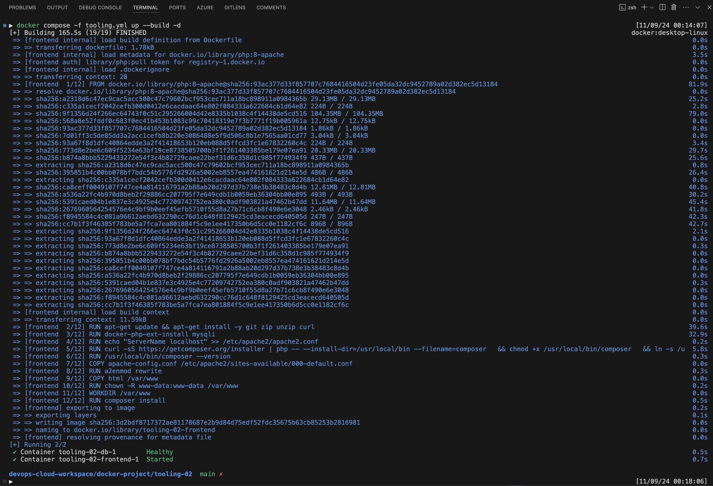

2. Check for running and exited containers

```bash
docker ps -a
```
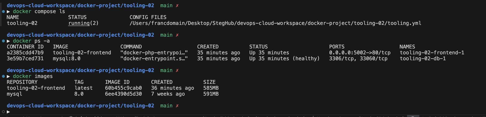

3. Access the database container

```bash
docker exec -it tooling-02-db-1 mysql -u francis -p
```
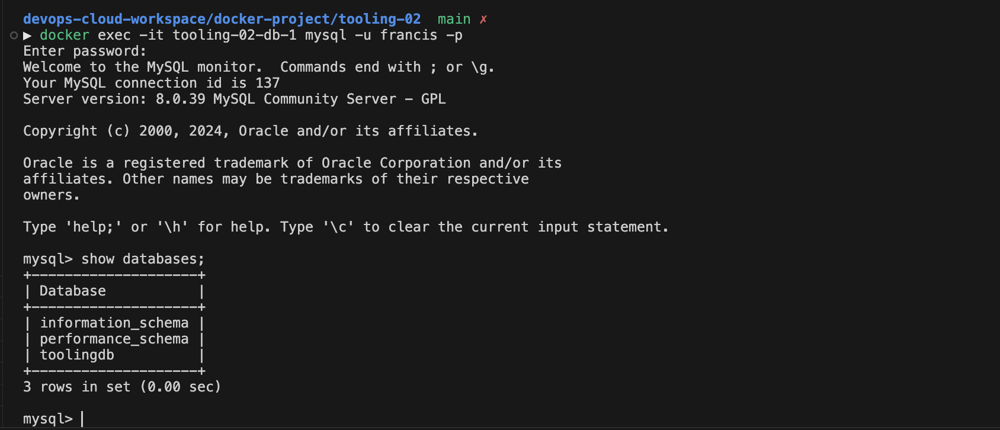

4. Check the tooling website with a browser on __http://localhost:5002__

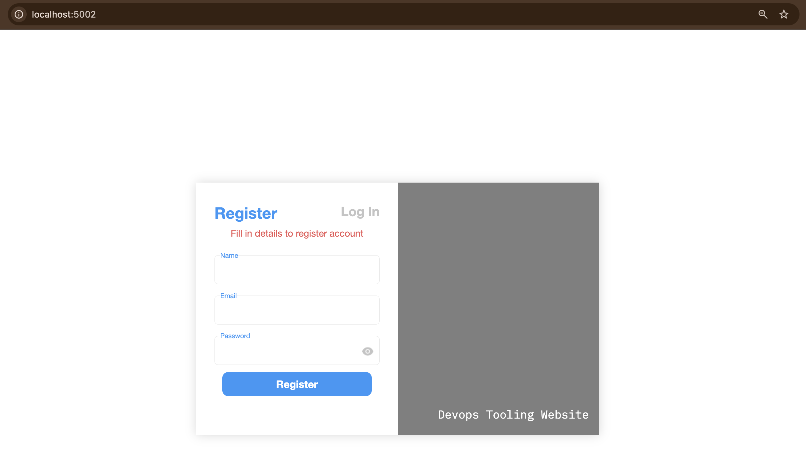

5. Tag the Docker Image

```bash
docker tag tooling-02-frontend:latest francdocmain/tooling-app:latest
```
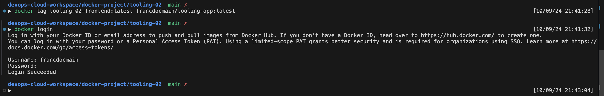

6. Login to DockerHub

```bash
docker login
```

7. Push docker image to docker registry

```bash
docker push francdocmain/tooling-app:latest
```
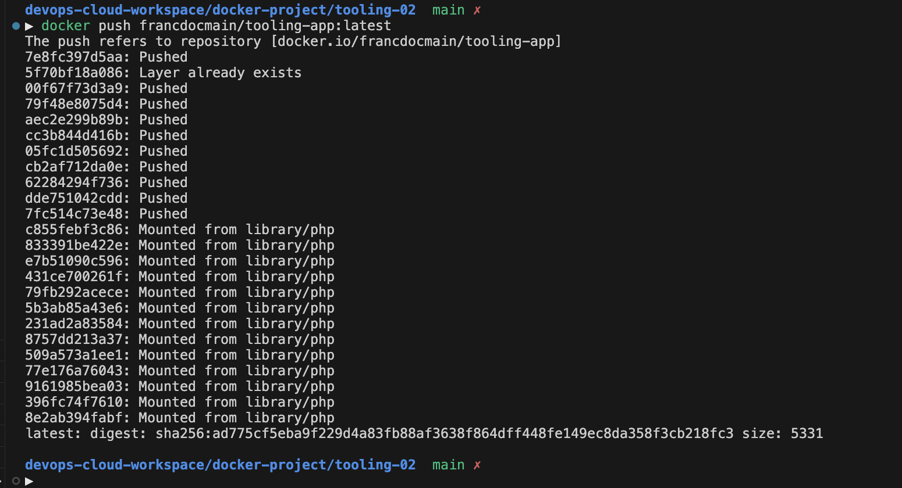

8. Check docker registry

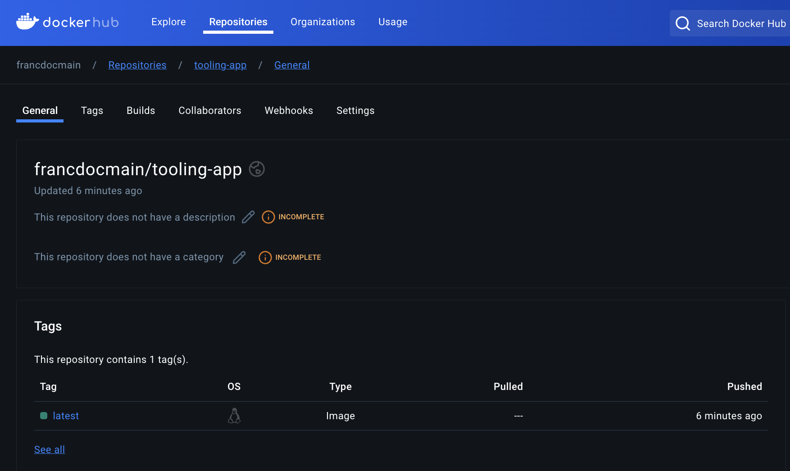


## Step 2: Write a Pod and a Service manifests, ensure that you can access the Tooling app's frontend using port-forwarding feature.

1. Create a pod manifest file for the tooling app - `tooling-pod.yaml`

```yaml
apiVersion: v1
kind: Pod
metadata:
  name: tooling-pod
  labels:
    app: tooling-app
spec:
  containers:
  - image: francdocmain/tooling-app:latest
    name: tooling-pod
    ports:
    - containerPort: 80
      protocol: TCP
```
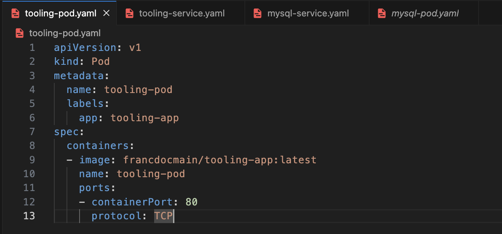


2. Create a service manifest file for the tooling app - `tooling-service.yaml`

```yaml
apiVersion: v1
kind: Service
metadata:
  name: tooling-service
spec:
  selector:
    app: tooling-app
  ports:
    - protocol: TCP
      port: 5003
      targetPort: 80
```
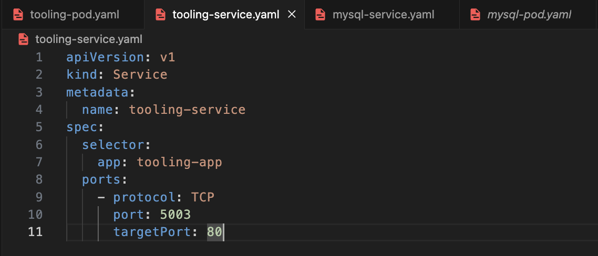

3. Craete a pod manifest file for database - `mysql-pod.yaml`

```yaml
apiVersion: v1
kind: Pod
metadata:
  name: mysql-pod
  labels:
    app: mysql-db
spec:
  containers:
    - name: mysql
      image: mysql:8.0
      env:
        - name: MYSQL_ROOT_PASSWORD
          value: password
        - name: MYSQL_DATABASE
          value: toolingdb
        - name: MYSQL_USER
          value: francis
        - name: MYSQL_PASSWORD
          value: Admin1234
      ports:
        - containerPort: 3306
```
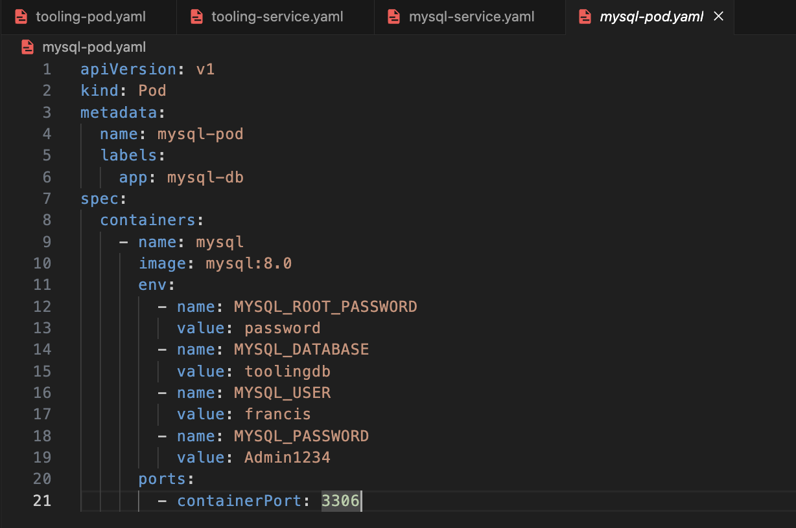

4. Craete a service manifest file for database - `mysql-service.yaml`

```yaml
apiVersion: v1
kind: Service
metadata:
  name: db
spec:
  selector:
    app: mysql-db
  type: ClusterIP
  ports:
    - port: 3306
      targetPort: 3306
```
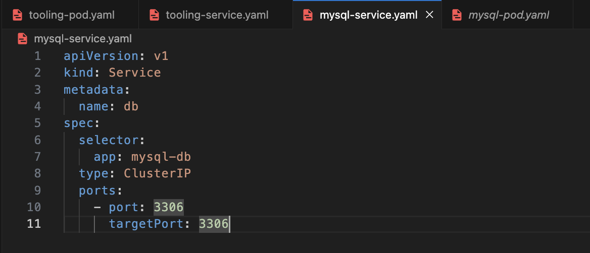

5. Apply the manifest with kubectl

```bash
kubectl apply -f tooling-pod.yaml
kubectl apply -f tooling-service.yaml

kubectl apply -f mysql-pod.yaml
kubectl apply -f mysql-service.yaml
```
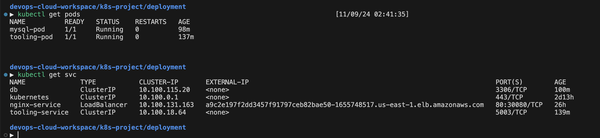


6. Run the port-forwarding command for both the tooling app and mysql

```bash
kubectl  port-forward svc/tooling-service 8090:5003

kubectl  port-forward svc/db 3306:3306
```

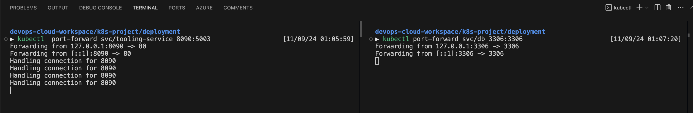

7. Access the Tooling app's frontend

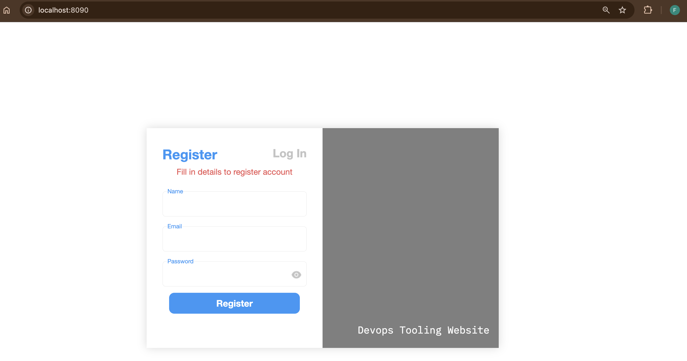
