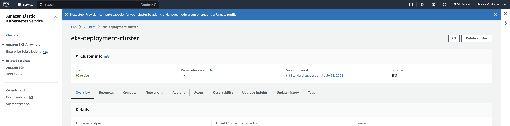
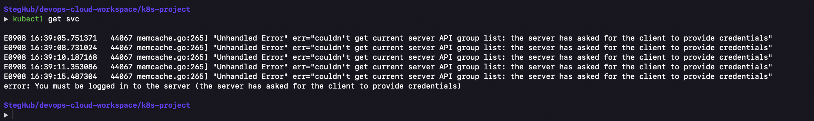

# Create EKS Cluster From The AWS Management Console

### Create IAM role for EKS Cluster

- Open the IAM console > Roles > click on Create role
- Under Trusted entity type, select AWS service.
- Under Use case for other AWS services dropdown list, choose __EKS__.
- Select __EKS - Cluster__ for the use case, then click Next.


__Add Permissions__


__Add Role Name and click on `create role` to create the role__


### Create IAM role for Worker Nodes

- Open the IAM console > Roles > click on Create role
- Under Trusted entity type, select AWS service.
- Under Use case for other AWS services dropdown list, choose __EC2__.
- Select __EC2__ for the use case, then click Next.


- Add the following permissions
  - AmazonEKSWorkerNodePolicy
  - AmazonEC2ContainerRegistryReadOnly
  - AmazonEKS_CNI_Policy

__Give the role a name and click `create role` to create the role__


## Create the EKS Cluster

- Go to EKS Console > Clusters > Add cluster
- Configure the cluster


- Specify Networking
  - You can use the default


- Configure Observatability
  - leave at default (disabled) to minimize cost


- Select Add-ons
  - select the default


- Confidgure the selected Add-ons


- Review and create




## Add Node Group to the Cluster

__Add a node group to the created cluster__

- Go to the EKS service > Cluster > click the cluster name.
- Go to the compute tab.
- Go to Node Groups > Add node group


- Give the node group a name
  - The Node IAM role created earlier is auto populated


- Configure Compute and Auto Scaling


- Specify networking and click next
- Review and create


### Connect to the EKS Cluster

To manage the cluster, connect using the AWS CLI

Ensure credentials have been set using `aws configure`

- Check that AWS CLI is Configured Correctly

```bash
aws sts get-caller-identity
```


- Check aws-iam-authenticator version if installed

```bash
aws-iam-authenticator version
```

### To configure your computer to communicate with your cluster

- Create or update a kubeconfig file for your cluster

```bash
aws eks update-kubeconfig --region us-east-1 --name eks-deployment-cluster
```


By default, the config file is created in `~/.kube` or the new cluster's configuration is added to an existing config file in `~/.kube`.

- Test your configuration.

```bash
kubectl get svc
```
On testing connection to the cluster, an error `error: You must be logged in to the server (the server has asked for the client to provide credentials)` was observed.



__Troubleshooting__

On checking the `aws-auth ConfigMap`, there was no entry with the `IAM` principal and as such, not mapped to Kubernetes group names that are bound to the `ClusterRole` with the necessary permissions.

- Edit ConfigMap file using the command below

```bash
kubectl edit configmap aws-auth -n kube-system
```


The ConfigMap file was edited via AWS `CloudShell` since the error persisted.
`mapRoles` and `mapUser` in the cofiguration below was added to update ConfigMap file

```yaml
apiVersion: v1
data:
  mapRoles: |
    groups:
      - system:masters
      rolearn: arn:aws:iam::992382613070:role/eksClusterRole
      username: admin:{{SessionName}}
  mapUsers: |
    groups:
      - system:masters
      userarn: arn:aws:iam::992382613070:user/k8s-Admin
      username: admin
kind: ConfigMap
metadata:
  name: aws-auth
  namespace: kube-system
```


Now, update the kubeconfig file for your cluster and test connection again

```bash
aws eks update-kubeconfig --region us-east-1 --name eks-deployment-cluster

kubectl get svc
```


- Let's access the nodes

```bash
kubectl get nodes
```


References:
- [Video](https://www.youtube.com/watch?v=-HtOdQitp2Q)
- [AWS EKS Docs](https://docs.aws.amazon.com/eks/latest/userguide/troubleshooting.html#unauthorized)
