# Implementing Secure HTTPS with Cert-Manager and Let’s Encrypt

In this project, we'll enhance the security of our Artifactory deployment by implementing HTTPS using [Cert-Manager](https://cert-manager.io) to request and manage TLS certificates from Let's Encrypt automatically. Cert-manager creates TLS certificates for workloads in your Kubernetes cluster and renews the certificates before they expire. This will provide a trusted HTTPS URL for our application.

### Prerequisites:

- EKS Kubernetes cluster with Nginx Ingress Controller installed
- Helm 3.x installed
- Kubectl configured to interact with your cluster
- Domain name configured with DNS pointing to your Ingress Controller's load balancer
- Nginx Ingress Controller installed ([from the previous project](https://github.com/francdomain/StegHub_DevOps-Cloud_Engineering/blob/main/Deploying_and_Packaging_applications_into_Kubernetes/project_25.md))

## Step 1: Install Cert-Manager

1. Add the __Jetstack__ Helm repository:

```bash
helm repo add jetstack https://charts.jetstack.io
```

2. Update your local Helm chart repository cache

```bash
helm repo update
```
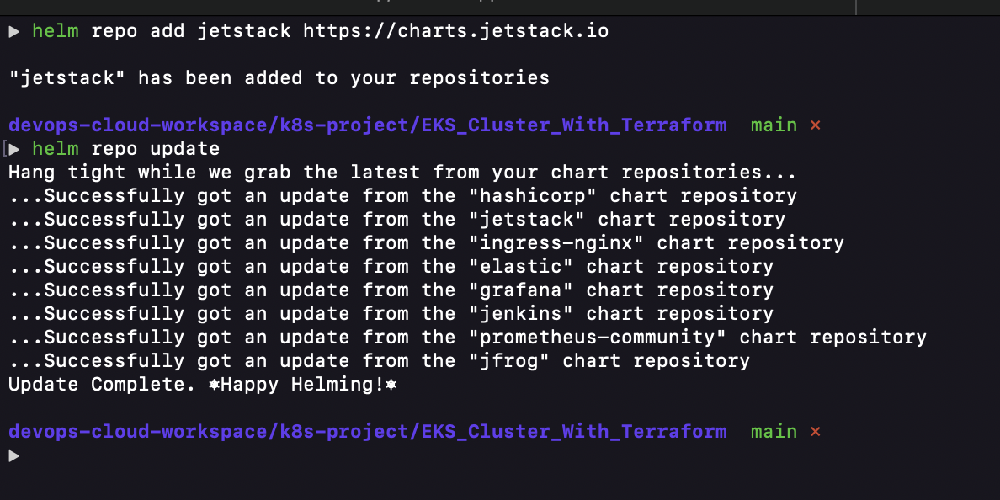

3. Follow the URL below to set up an EKS IAM role for a service account for cert-manager:
https://cert-manager.io/docs/configuration/acme/dns01/route53/#eks-iam-role-for-service-accounts-irsa

### Please make sure to do the following:

- __Create an IAM Service Account Role for the cert-manager with the IAM policy.__

### IAM Open ID Connect provider for the cluster

This is required for associating k8s Service Accounts with AWS IAM roles and policies. This is considered more secure than allowing the worker nodes to access AWS services (e.g. S3 Buckets, Route53 DNS, etc.).

```bash
eksctl utils associate-iam-oidc-provider --cluster name-of-the-cluster --region us-west-1
```

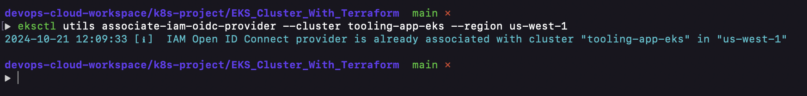

A. Retrieve IAM OIDC Provider for Your EKS Cluster

```bash
aws eks describe-cluster --name <EKS_CLUSTER_NAME> --query "cluster.identity.oidc.issuer" --output text
```
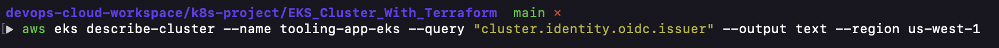
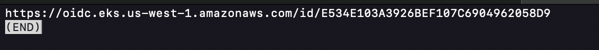

B. Create IAM policy for cert-manager to manage Route53 records. Paste the policy document below in a file named CertManagerPolicy.json

```json
{
    "Version": "2012-10-17",
    "Statement": [
        {
            "Sid": "",
            "Effect": "Allow",
            "Action": "route53:ChangeResourceRecordSets",
            "Resource": "arn:aws:route53:::hostedzone/*"
        },
        {
            "Sid": "",
            "Effect": "Allow",
            "Action": [
                "route53:GetChange",
                "route53:ListHostedZones",
                "route53:ListResourceRecordSets",
                "route53:ListHostedZonesByName"
            ],
            "Resource": "*"
        }
    ]
}
```
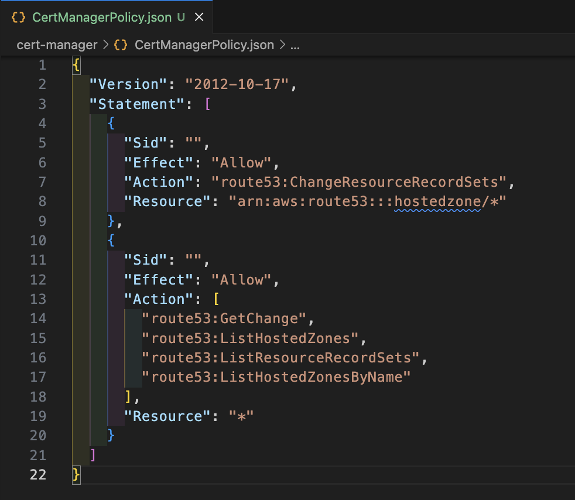

- Go to the IAM console, navigate to Policies to create the cer-manager route53 policy

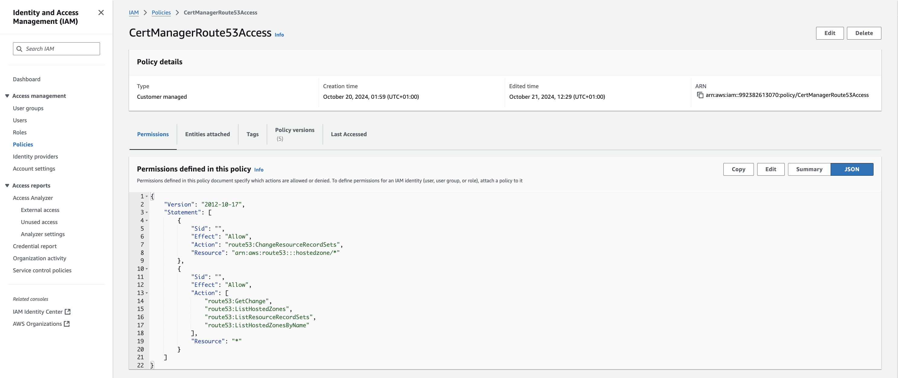

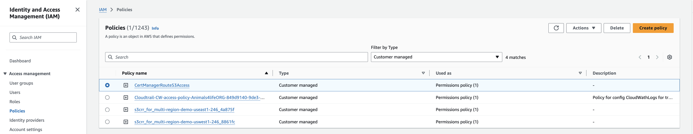

C. Create an IAM Role for the cert-manager ServiceAccount

- Create a file and name it __cert-manager-trust-policy.json__

use the snippet below to create the Trust relationship

```json
{
  "Version": "2012-10-17",
  "Statement": [
    {
      "Effect": "Allow",
      "Action": "sts:AssumeRoleWithWebIdentity",
      "Principal": {
        "Federated": "arn:aws:iam::<aws-account-id>:oidc-provider/oidc.eks.<aws-region>.amazonaws.com/id/<eks-hash>"
      },
      "Condition": {
        "StringEquals": {
          "oidc.eks.<aws-region>.amazonaws.com/id/<eks-hash>:sub": "system:serviceaccount:<namespace>:<service-account-name>"
        }
      }
    }
  ]
}
```
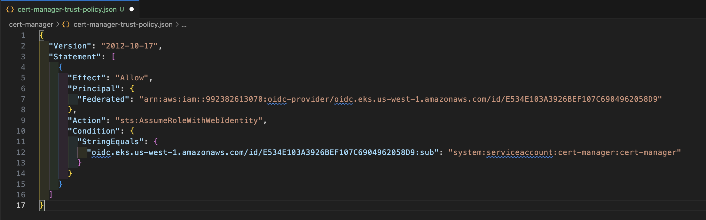

- Create the role, name it __cert-manager__ (Include the trusted entity)

```bash
aws iam create-role \
--role-name cert-manager \
--assume-role-policy-document file://"cert-manager-trust-policy.json"
```
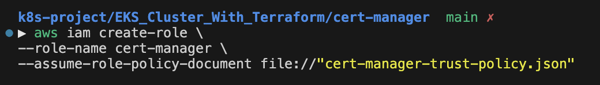


- Attach the IAM policy created earlier

```bash
aws iam attach-role-policy \
--policy-arn arn:aws:iam::123456789012:policy/CertManagerRoute53Access \
--role-name cert-manager
```
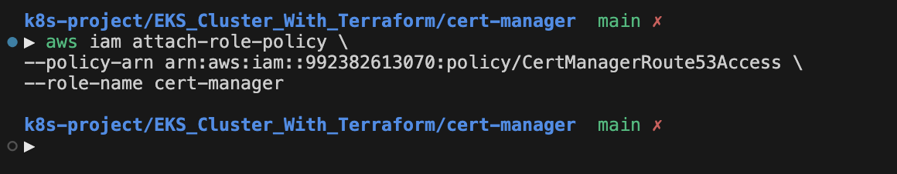

### __Set up a serviceAccount resource to be used by the cert-manager.__

Create namespace

```bash
kubectl create ns cert-manager
```
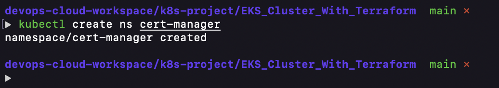

cert-manager ServiceAccount:

```yaml
apiVersion: v1
automountServiceAccountToken: true
kind: ServiceAccount
metadata:
  annotations:
    eks.amazonaws.com/role-arn: arn:aws:iam::312973238800:role/cert_manager_role
  name: cert-manager
  namespace: cert-manager
...
```
Replace with created role arn.

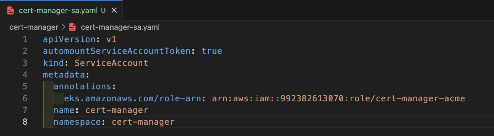

A. Apply the manifest

```bash
kubectl apply -f cert-manager-sa.yaml
```

B. Verify the ServiceAccount Configuration

```bash
kubectl describe sa cert-manager -n cert-manager
```

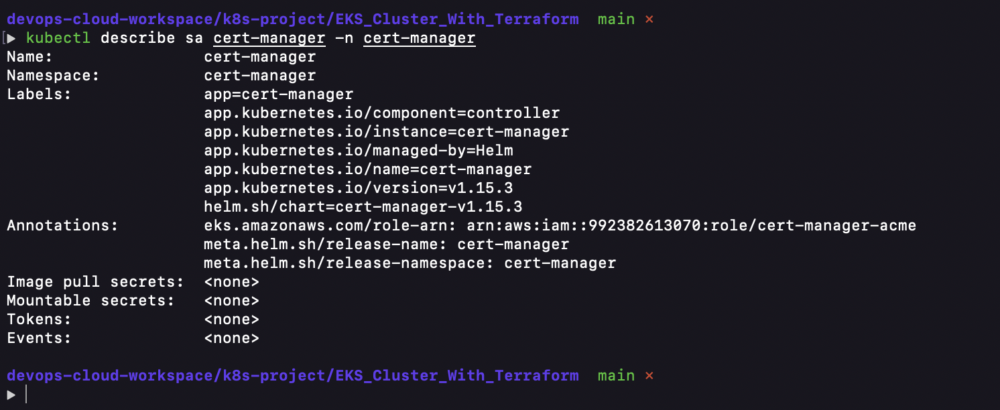

- __Configure RBAC for Cert-Manager `ServiceAccount`__

```yaml
apiVersion: rbac.authorization.k8s.io/v1
kind: ClusterRole
metadata:
  namespace: cert-manager
  name: cert-manager
rules:
  - apiGroups: [""]
    resources: ["serviceaccounts", "serviceaccounts/token"]
    verbs: ["create"]
  - apiGroups: ["cert-manager.io"]
    resources: ["certificaterequests"]
    verbs: ["get", "list", "watch", "create", "update", "patch"]
---
apiVersion: rbac.authorization.k8s.io/v1
kind: ClusterRoleBinding
metadata:
  name: cert-manager-acme-binding
subjects:
  - kind: ServiceAccount
    name: cert-manager
    namespace: cert-manager
roleRef:
  apiGroup: rbac.authorization.k8s.io
  kind: ClusterRole
  name: cert-manager
```

We want to Grant permissions across the entire Kubernetes cluster, allowing __cert-manager__ to manage DNS records for our hosted zone across multiple namespaces, rather than Grant permissions within a specific namespace. So we use ClusterRoleBinding and ClusterRole.

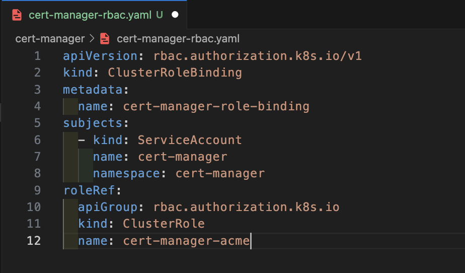

- Apply the configuration

```bash
kubectl apply -f cert-manager-rbac.yaml
```

4. Install Cert-Manager using Helm

```bash
helm install cert-manager jetstack/cert-manager \
  --namespace cert-manager \
  --create-namespace \
  --version v1.15.3 \
  --set crds.enabled=true
```
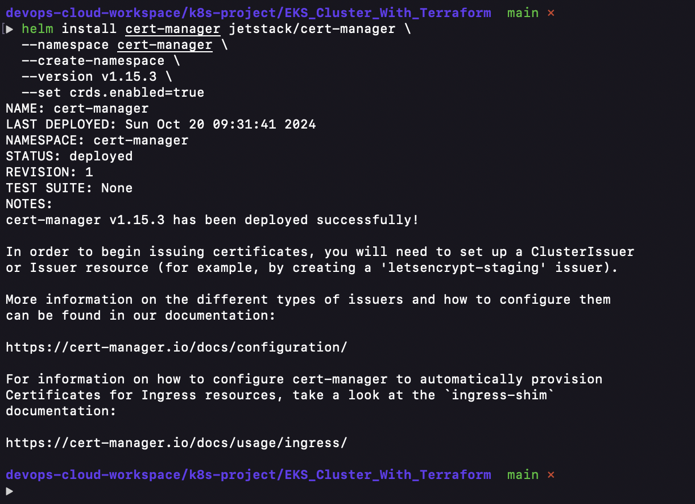


- __Modify Cert-manager Deployment with correct file system permissions. This will allow the pod to read the ServiceAccount token.__

```yaml
spec:
  template:
    securityContext:
      fsGroup: 1001
```
```bash
helm upgrade --install cert-manager jetstack/cert-manager \
  --namespace cert-manager \
  --create-namespace \
  --version v1.15.3 \
  --set installCRDs=true \
  --set securityContext.fsGroup=1001
```
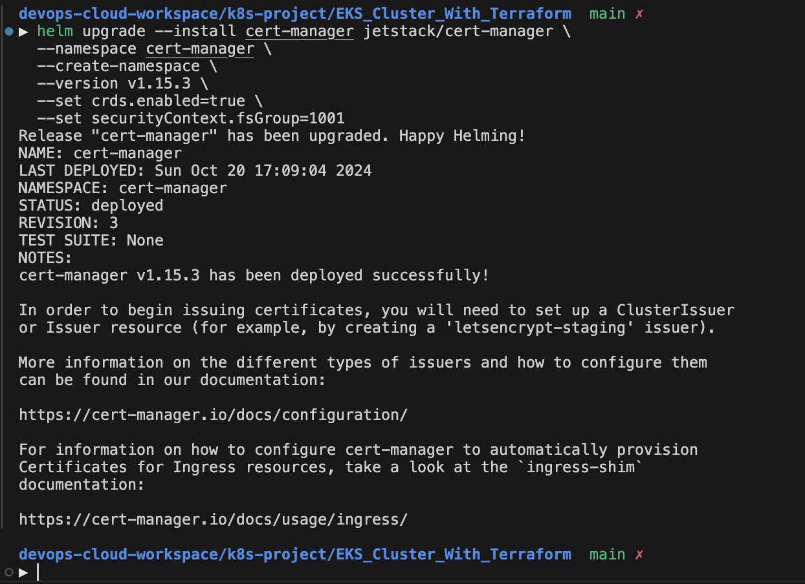

5. Verify the Cert-Manager installation:

```bash
kubectl get pods --namespace cert-manager
```
Expected output:

```
NAME                                       READY   STATUS    RESTARTS   AGE
cert-manager-9647b459d-dfr6s               1/1     Running   0          51s
cert-manager-cainjector-5d8798687c-mlt8f   1/1     Running   0          51s
cert-manager-webhook-c77744d75-6d7dj       1/1     Running   0          51s
```
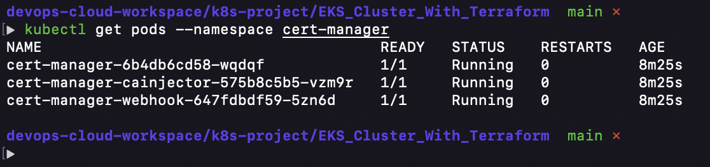


This diagram illustrates the main components of __Cert-Manager__:

- __Cert-Manager Controller:__ Manages the certificate lifecycle
- __Webhook:__ Validates and mutates resources
- __CA Injector:__ Injects CA bundles into resources
- __Custom Resource Definitions (CRDs):__ Define custom resources like Certificate, Issuer, and ClusterIssuer

## Step 2: Configure Let's Encrypt Issuer

1. Create a file named `lets-encrypt-issuer.yaml` and add the following content:

```yaml
apiVersion: cert-manager.io/v1
kind: ClusterIssuer
metadata:
  name: letsencrypt-prod
spec:
  acme:
    server: https://acme-v02.api.letsencrypt.org/directory
    email: devops@steghub.com
    privateKeySecretRef:
      name: letsencrypt-prod
    solvers:
    - selector:
        dnsZones:
          - "steghub.com"
      dns01:
        route53:
          region: us-east-1
          role: "arn:aws:iam::123456789012:role/cert_manager_role" # This must be set so cert-manager what role to attempt to authenticate with
          auth:
            kubernetes:
              serviceAccountRef:
                name: "cert-manager" # The name of the service account created
```
Replace devops@steghub.com with your actual email addres and the role ARN to you one you created. Update serviceAccount name if necessary.

This ClusterIssuer is set up to use Let's Encrypt for SSL/TLS certificates, solving ACME challenges using DNS-01 with Amazon Route 53, and authenticating via a Kubernetes service account.

2. Apply the ClusterIssuer:

```bash
kubectl apply -f lets-encrypt-issuer.yaml
```
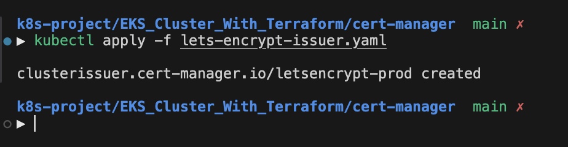

3. Verify the ClusterIssuer:

```bash
kubectl get clusterissuer
```
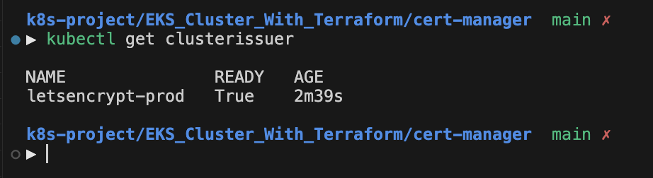


## Step 3: Update Ingress for Artifactory

1. Update your Artifactory Ingress to include TLS configuration:

```yaml
apiVersion: networking.k8s.io/v1
kind: Ingress
metadata:
  name: artifactory-ingress
  namespace: tools
  annotations:
    nginx.ingress.kubernetes.io/proxy-body-size: 500m
    service.beta.kubernetes.io/aws-load-balancer-scheme: internet-facing
    service.beta.kubernetes.io/aws-load-balancer-type: nlb
    service.beta.kubernetes.io/aws-load-balancer-backend-protocol: ssl
    service.beta.kubernetes.io/aws-load-balancer-ssl-ports: "443"
    cert-manager.io/cluster-issuer: letsencrypt-prod
    cert-manager.io/private-key-rotation-policy: Always
  labels:
    name: artifactory
spec:
  ingressClassName: nginx
  tls:
  - hosts:
    - tooling.artifactory.steghub.com
    secretName: tooling.artifactory.steghub.com
  rules:
  - host: tooling.artifactory.steghub.com
    http:
      paths:
      - path: /
        pathType: Prefix
        backend:
          service:
            name: artifactory
            port:
              number: 8082
```

Please make a note of the following information:

- __`metadata.annotations`:__ We have a cert-manager cluster issuer annotation, which points to the ClusterIssuer we previously created. If Cert-Manager observes an Ingress with annotations described in the [Supported Annotations](https://cert-manager.io/docs/usage/ingress/#supported-annotations) section, it will ensure that a Certificate resource with the name provided in the tls.secretName field and configured as described on the Ingress exists in the namespace.

- __`spec.tls`:__ We added the tls block, which determines what ends up in the cert's configuration. The tls.hosts will be added to the cert's subjectAltNames.

- __`proxy-body-size`:__ This is used to set the maximum size of a file we want to allow in our Artifactory. The initial value is lower, so you won't be able to upload a larger size artifact unless you add this annotation. A 413 error will be returned when the size in a request exceeds the maximum allowed size of the client request body.

2. Apply the updated Ingress:

```bash
kubectl apply -f artifactory-ingress.yaml -n tools
```
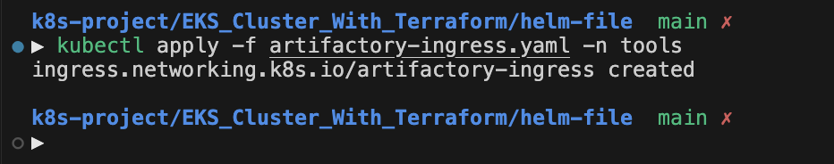

## Step 4: Verify Certificate Issuance

1. Check the status of the Certificate:

```bash
kubectl get certificate -n tools
```
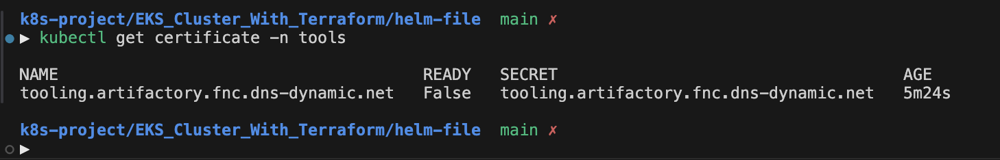

2. Describe the Certificate for more details:

```bash
kubectl describe certificate artifactory-tls -n tools
```
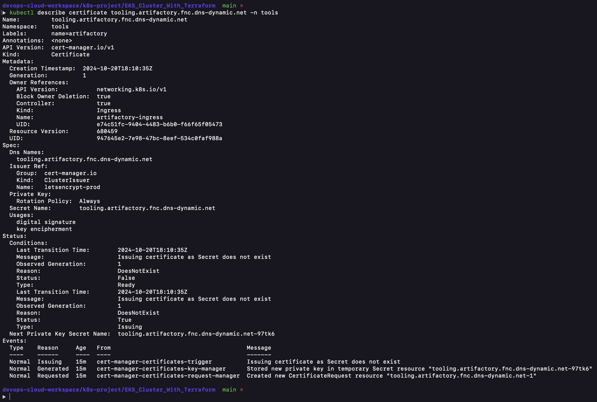

Look for the "Status" section to confirm that the certificate was successfully issued. When you check it first, you should see something like this:

```
NAME                                                          READY   SECRET                            AGE
certificate.cert-manager.io/tooling.artifactory.steghub.com   False   tooling.artifactory.steghub.com   86s
```


Which will later change to Ready after your certificate requests has been validated:

```
NAME                                                          READY   SECRET                            AGE
certificate.cert-manager.io/tooling.artifactory.steghub.com   True    tooling.artifactory.steghub.com   10m
```
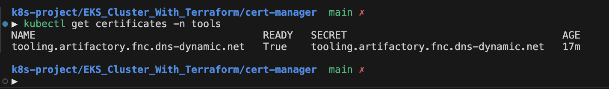


## Step 5: Test HTTPS Access

1. Open a web browser and navigate to https://tooling.artifactory.fnc.dns-dynamic.net

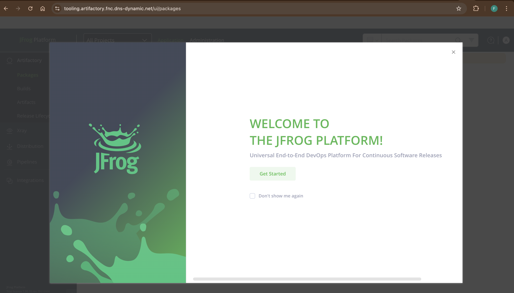

2. Verify that the connection is secure and the certificate is valid.

- Click on the padlock icon in the address bar

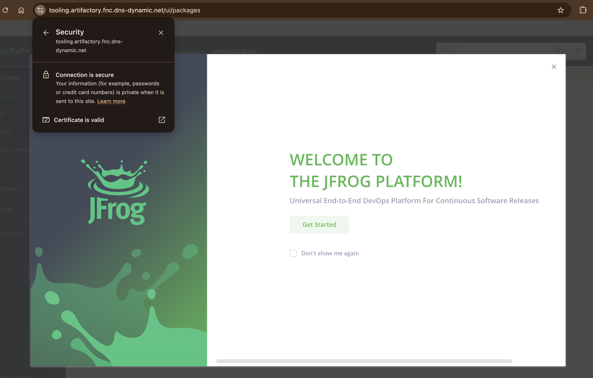

- View the certificate details
- Confirm that Let's Encrypt issues it

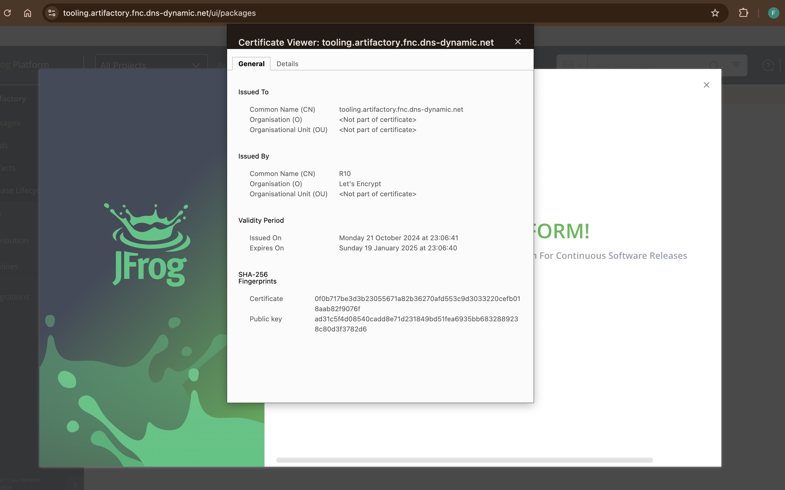

Flow of HTTPS traffic and certificate issuance


1. User sends an HTTPS request to the Ingress Controller
2. Cert-Manager requests a certificate from Let's Encrypt
3. Let's Encrypt validates the request and issues the certificate
4. Cert-Manager configures the Ingress Controller with the new certificate
5. Ingress Controller serves HTTPS traffic to the user
Requests are routed to the Artifactory service

## Conclusion

In this project, we've successfully implemented HTTPS for our Artifactory deployment with a trusted SSL/TLS certificate from Let's Encrypt using Cert-Manager. This setup provides automatic certificate management and renewal, ensuring our application remains secure with minimal manual intervention.


### Additional Resources

- [Cert-Manager Documentation](https://cert-manager.io/docs/configuration/acme/dns01/route53/)
- [GitHub - Cert-Manager Issues](https://github.com/cert-manager/cert-manager/issues/3079)
- [JFrof Artifactory Documentation](https://jfrog.com/help/r/artifactory-deploying-artifactory-helm-charts-with-nginx-ingress/values.yaml)
- [GitHub - jfrog-platform](https://github.com/jfrog/charts/blob/master/stable/jfrog-platform/values.yaml)
- [GitHub - ingress-nginx](https://github.com/kubernetes/ingress-nginx/blob/main/charts/ingress-nginx/values.yaml)
- [YouTube - Cert Manager Kubernetes Tutorial](https://www.youtube.com/watch?v=7m4_kZOObzw&t=2018s)


## Additional Task:

1.  Automate the entire process you performed using __Terraform__ with the [Helm Provider](https://registry.terraform.io/providers/hashicorp/helm/latest) and [Kubernetes Provider](https://registry.terraform.io/providers/hashicorp/kubernetes/latest).

2. Implement SSL/TLS certificates for the previously deployed DevOps tools.

### Click below to see the automation of entire process and implementation of SSL/TLS certificate.

[Automation with Terraform and Helm](https://github.com/francdomain/k8s_with_terraform_and_helm)
